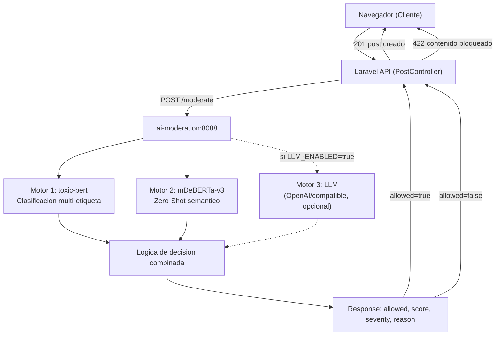

# AI Moderation

## Que es

El microservicio de moderacion de inteligencia artificial es un servidor HTTP independiente escrito en Node.js que se encarga de analizar el contenido textual de publicaciones y comentarios antes de que sean persistidos en la base de datos. No forma parte del backend principal de Laravel, sino que opera como un componente separado al que Laravel llama de forma sincrona durante la creacion de contenido.

Ademas de la moderacion, el servicio realiza dos tareas adicionales: genera resumenes automaticos del contenido publicado y produce vectores de embeddings (representaciones matematicas del significado del texto) que se usan para calcular tendencias entre publicaciones de forma semantica.

---

## Por que existe como microservicio separado

Los modelos de inteligencia artificial que se ejecutan localmente son computacionalmente costosos. Al separar este componente del backend de Laravel se consigue lo siguiente:

- El backend no se ve bloqueado por el tiempo que tarda en cargar o ejecutar los modelos.
- Los modelos se inicializan una sola vez al arrancar el contenedor y quedan en memoria, eliminando el coste de inicializacion en cada peticion.
- El servicio puede escalar de forma independiente o sustituirse sin afectar al resto del sistema.
- Si el servicio no esta disponible, Laravel puede configurarse para actuar en modo `fail_open` y permitir el contenido igualmente.

---

## Arquitectura del servicio



---

## Modelos utilizados

### 1. Toxic-BERT (`Xenova/toxic-bert`)

- **Tipo:** Clasificacion de texto multi-etiqueta.
- **Proposito:** Detectar toxicidad explicita: insultos, amenazas, lenguaje obsceno, acoso, identidad hate.
- **Implementacion:** Se carga con `@xenova/transformers` via pipeline de `text-classification`. El modelo se ejecuta en local sobre ONNX (Open Neural Network Exchange), sin enviar datos a servicios externos.
- **Umbral de bloqueo:** Si el score maximo entre todas las etiquetas supera `AI_BLOCK_THRESHOLD` (por defecto `0.85`), el contenido es rechazado.

### 2. mDeBERTa-v3 (`MoritzLaurer/mDeBERTa-v3-base-mnli-xnli`)

- **Tipo:** Zero-Shot Classification.
- **Proposito:** Analisis semantico. Evalua el contenido contra etiquetas descriptivas sin haber sido entrenado explicitamente para ello. Las etiquetas que usa el sistema son:
  - `deseo explicito de dano o enfermedad`
  - `acoso grave o humillacion`
  - `amenaza o violencia contra una persona`
  - `contenido respetuoso o neutro`
- **Implementacion:** Pipeline `zero-shot-classification`. Para cada texto calcula una probabilidad de pertenencia a cada etiqueta. El harmScore es el maximo entre las etiquetas de dano (excluyendo la etiqueta de contenido neutro).
- **Umbral de bloqueo:** Si el harmScore supera `AI_ZERO_SHOT_BLOCK_THRESHOLD` (por defecto `0.75`), el contenido es rechazado.

### 3. LLM (opcional, desactivado por defecto)

- **Tipo:** Large Language Model via API REST (compatible con la API de OpenAI).
- **Proposito:** Moderacion de mayor precision cuando se dispone de clave API. Si esta activo, su decision tiene prioridad absoluta sobre los otros dos motores.
- **Configuracion:** Variables `AI_LLM_ENABLED=true`, `AI_LLM_API_KEY`, `AI_LLM_BASE_URL` y `AI_LLM_MODEL`.
- **Política enviada al modelo:**
  > Eres un moderador de comunidad educativa. Evalua si el contenido es baneable segun violencia, acoso, deseos de daño, discurso de odio, amenazas o abuso grave. Responde SOLO JSON valido.

---

## Endpoints del servicio

### `GET /health`

Devuelve el estado de los modelos cargados. Util para saber si el servicio esta listo y que modelos han inicializado correctamente.

```json
{
  "status": "ok",
  "service": "ai-moderation",
  "model": "Xenova/toxic-bert",
  "model_loaded": true,
  "zero_shot_loaded": true,
  "llm_enabled": false,
  "summary_loaded": true,
  "embedding_loaded": true
}
```

### `POST /moderate`

Recibe el contenido a analizar y devuelve la decision de moderacion.

**Request:**
```json
{
  "context": "post",
  "content": "Texto del mensaje a analizar",
  "code_snippet": "// Codigo opcional",
  "image_present": false
}
```

**Response (contenido permitido):**
```json
{
  "allowed": true,
  "score": 0.1234,
  "severity": "low",
  "reason": "Content accepted by combined AI moderation.",
  "categories": [],
  "engine": "model+zero-shot"
}
```

**Response (contenido bloqueado):**
```json
{
  "allowed": false,
  "score": 0.9210,
  "severity": "critical",
  "reason": "Rejected by model moderation.",
  "categories": ["toxic", "threat"],
  "engine": "model+zero-shot"
}
```

### `POST /analyze-content`

Genera un resumen y un embedding vectorial del contenido. Se usa para la funcionalidad de posts trending.

**Request:**
```json
{
  "content": "Texto de la publicacion",
  "code_snippet": null
}
```

**Response:**
```json
{
  "summary": "Resumen generado de 1-2 frases.",
  "embedding": [0.1234, -0.5678, ...]
}
```

---

## Logica de decision combinada

Cuando estan activos tanto `toxic-bert` como `mDeBERTa-v3`, el sistema combina ambas decisiones con la siguiente logica:

```mermaid
flowchart TD
    Start(["Texto recibido"])
    LLMCheck{"LLM activo\ny responde?"}
    LLMDecision["Usar decision del LLM"]
    ModelCheck{"toxic-bert\ndisponible?"}
    ZeroCheck{"zero-shot\ndisponible?"}
    BothAvail{"Ambos disponibles?"]
    AnyReject{"Alguno rechaza?"}
    Accept(["PERMITIDO\nallowed: true"])
    Block(["BLOQUEADO\nallowed: false"])
    Unavailable(["BLOQUEADO\nservice_unavailable"])

    Start --> LLMCheck
    LLMCheck -- Si --> LLMDecision --> Accept
    LLMCheck -- No --> ModelCheck
    ModelCheck -- Si --> ZeroCheck
    ZeroCheck -- Si --> BothAvail
    BothAvail -- Si --> AnyReject
    AnyReject -- Si (alguno rechaza) --> Block
    AnyReject -- No (ambos aceptan) --> Accept
    BothAvail -- No --> Accept
    ModelCheck -- No --> ZeroCheck
    ZeroCheck -- No --> Unavailable
```

El campo `engine` en la respuesta indica que motor tomo la decision: `model`, `zero-shot`, `model+zero-shot` o `llm`.

---

## Niveles de severidad

| Rango de score | Severidad  |
|----------------|------------|
| 0.00 - 0.59    | low        |
| 0.60 - 0.79    | medium     |
| 0.80 - 0.91    | high       |
| 0.92 - 1.00    | critical   |

Los umbrales exactos son configurables via variables de entorno.

---

## Modelos de summarizacion y embedding

### Summarizacion (`Xenova/distilbart-cnn-6-6`)

Modelo de resumen extractivo. Se aplica al contenido de cada publicacion para generar un resumen de entre `AI_SUMMARY_MIN_TOKENS` y `AI_SUMMARY_MAX_TOKENS` tokens (por defecto entre 20 y 60). Si el LLM esta activo, se usa el LLM para resumir en su lugar, con instrucciones mas precisas en castellano.

### Embeddings (`Xenova/all-MiniLM-L6-v2`)

Modelo de embeddings semanticos. Convierte el texto en un vector de 384 dimensiones que representa su significado en un espacio matematico. Estos vectores se guardan en la columna `embedding` de la tabla `posts` y se usan para calcular similitud semantica entre publicaciones en la funcionalidad de trending.

---

## Configuracion completa de variables de entorno

| Variable | Valor por defecto | Descripcion |
|---|---|---|
| `PORT` | `8088` | Puerto HTTP del servicio |
| `AI_MODERATION_API_KEY` | (vacio) | Clave de autenticacion entre Laravel y el servicio |
| `AI_MODEL_ENABLED` | `true` | Activa o desactiva toxic-bert |
| `AI_MODEL_ID` | `Xenova/toxic-bert` | ID del modelo de toxicidad en Hugging Face |
| `AI_ZERO_SHOT_ENABLED` | `true` | Activa o desactiva el clasificador zero-shot |
| `AI_ZERO_SHOT_MODEL_ID` | `MoritzLaurer/mDeBERTa-v3-base-mnli-xnli` | ID del modelo zero-shot |
| `AI_ZERO_SHOT_BLOCK_THRESHOLD` | `0.75` | Umbral de bloqueo para zero-shot |
| `AI_LLM_ENABLED` | `false` | Activa el uso de LLM externo |
| `AI_LLM_BASE_URL` | `https://api.openai.com/v1` | URL base del API del LLM |
| `AI_LLM_API_KEY` | (vacio) | Clave API del LLM |
| `AI_LLM_MODEL` | `gpt-4o-mini` | Modelo LLM a usar |
| `AI_BLOCK_THRESHOLD` | `0.85` | Umbral de bloqueo para toxic-bert |
| `AI_MEDIUM_THRESHOLD` | `0.60` | Umbral para severidad medium |
| `AI_HIGH_THRESHOLD` | `0.80` | Umbral para severidad high |
| `AI_CRITICAL_THRESHOLD` | `0.92` | Umbral para severidad critical |
| `AI_MAX_TEXT_LENGTH` | `6000` | Longitud maxima del texto a procesar |
| `AI_SUMMARY_ENABLED` | `true` | Activa la generacion de resumenes |
| `AI_SUMMARY_MODEL_ID` | `Xenova/distilbart-cnn-6-6` | Modelo de resumen |
| `AI_SUMMARY_MAX_TOKENS` | `60` | Tokens maximos en el resumen |
| `AI_SUMMARY_MIN_TOKENS` | `20` | Tokens minimos en el resumen |
| `AI_EMBEDDING_ENABLED` | `true` | Activa la generacion de embeddings |
| `AI_EMBEDDING_MODEL_ID` | `Xenova/all-MiniLM-L6-v2` | Modelo de embeddings |

---

## Como se integra en Laravel

La integracion se hace a traves de `AiModerationService.php`. Cuando un usuario crea una publicacion o comentario, el controlador correspondiente llama al servicio:

```php
// Dentro de PostController@store (simplificado)
$moderation = app(AiModerationService::class)->moderatePost(
    content: $request->content,
    codeSnippet: $request->code_snippet,
    hasImage: $request->hasFile('image')
);

if (!$moderation['allowed']) {
    // Incrementar strikes de moderacion del usuario
    // Devolver 422 con razon del bloqueo
}
```

Si el servicio no responde (timeout o error de red), el comportamiento depende de `fail_open`:
- `fail_open = true` (por defecto): el contenido se permite.
- `fail_open = false`: el contenido se bloquea.

El timeout esta configurado en `AI_MODERATION_TIMEOUT_SECONDS` (4 segundos en produccion).

---

## Referencia de archivos

- Codigo fuente del servicio: [ai-moderation/index.js](file:///home/chuclao/Escritorio/projecte-final-2025-26-daw-codex_trfinal_grup4/ai-moderation/index.js)
- Dockerfile del servicio: [ai-moderation/Dockerfile](file:///home/chuclao/Escritorio/projecte-final-2025-26-daw-codex_trfinal_grup4/ai-moderation/Dockerfile)
- Servicio de integracion Laravel: [api/app/Services/AiModerationService.php](file:///home/chuclao/Escritorio/projecte-final-2025-26-daw-codex_trfinal_grup4/api/app/Services/AiModerationService.php)
- Servicio de contenido Laravel: [api/app/Services/AiContentService.php](file:///home/chuclao/Escritorio/projecte-final-2025-26-daw-codex_trfinal_grup4/api/app/Services/AiContentService.php)
