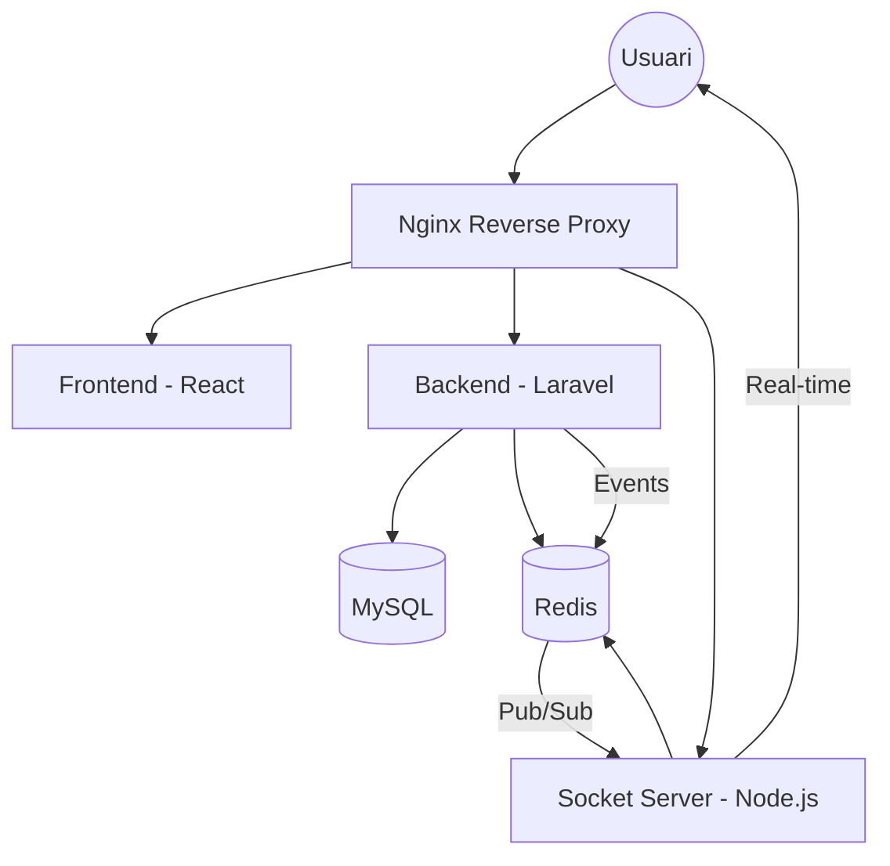

# 🏗️ Arquitectura del Sistema

Aquest document descriu l'arquitectura tècnica del projecte **Codex**. El sistema està dissenyat seguint un enfocament de microserveis containeritzats, prioritzant l'escalabilitat i la separació de responsabilitats.

## 🧱 Components del Sistema

El sistema es divideix en quatre components principals que s'executen en contenidors Docker independents:

### 1. Frontend (Client)
- **Tecnologia:** React 18 + Vite.
- **Responsabilitat:** Interfície d'usuari, gestió de l'estat en el client, i interacció amb l'API i els WebSockets.
- **Comunicació:** HTTP/REST cap a l'API i WebSockets cap al servidor de Sockets.

### 2. Backend (API)
- **Tecnologia:** Laravel 11 (PHP 8.3).
- **Responsabilitat:** Lògica de negoci, gestió de la base de dades (MySQL), autenticació (Sanctum), validació de dades i tramesa de correus (Resend).
- **Patrons:** Utilitza el patró MVC estàndard de Laravel, amb Serveis per a la lògica complexa.

### 3. Real-time (Socket Server)
- **Tecnologia:** Node.js + Socket.io.
- **Responsabilitat:** Gestió de la comunicació bidireccional en temps real (xat, notificacions instantànies).
- **Adaptador:** Utilitza Redis com a adaptador per permetre la comunicació entre Laravel i el servidor de Sockets via Pub/Sub.

### 4. AI Moderation
- **Tecnologia:** Node.js + @xenova/transformers (ONNX).
- **Responsabilitat:** Moderació activa de publicacions/comentaris, resumització i generació de vectors (embeddings).
- **Model de toxicitat:** `Xenova/toxic-bert` (bloqueja si el score supera **0.85**).
- **Model semàntic:** `mDeBERTa-v3` per a Zero-Shot (bloqueja en categories de dany si el score supera **0.75**).

---

## 🔄 Flux de Comunicació

### Detalls de la Interacció:
- **Autenticació:** Es realitza mitjançant Laravel Sanctum (tokens d'estat). El client emmagatzema el token i l'envia en les capçaleres `Authorization`.
- **Temps Real:** Quan passa un esdeveniment a Laravel (ex: nou missatge), Laravel publica un missatge a Redis. El servidor de Node.js, que està subscrit a aquests canals, rep la notificació i l'emet al client corresponent via Socket.io.

---

## 📂 Estructura de Carpetes

| Carpeta | Descripció |
| --- | --- |
| `/api` | Codi font del backend (Laravel). |
| `/client` | Codi font del frontend (React). |
| `/socket` | Codi font del servidor de temps real (Node.js). |
| `/ai-moderation` | Microservei de moderació, resumització i embeddings (Node.js + Transformers). |
| `/docker` | Configuracions de Nginx, PHP i MySQL per a cada entorn. |
| `/doc` | Documentació tècnica i funcional. |

---

## 🛠️ Stack de Tecnologies

- **Llenguatges:** PHP, JavaScript (JSX), SQL.
- **Frameworks:** Laravel, React.
- **Bases de dades:** MySQL (Persistent), Redis (Cache/Transitori).
- **Infraestructura:** Docker, Nginx.
