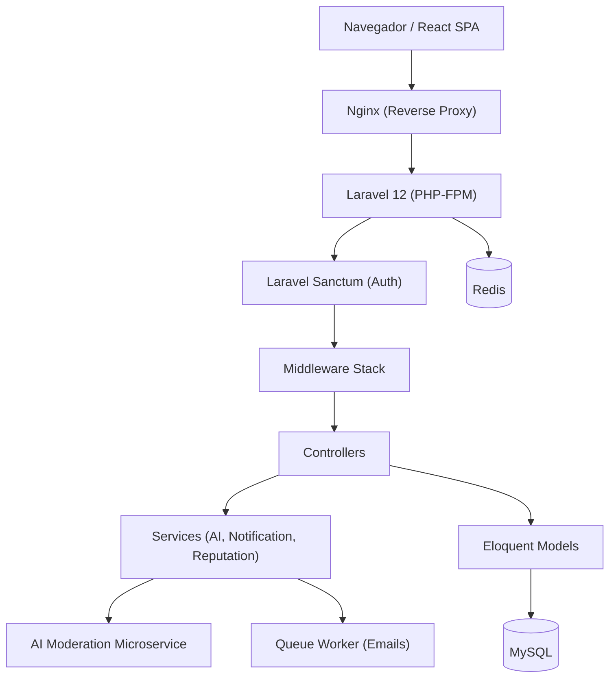
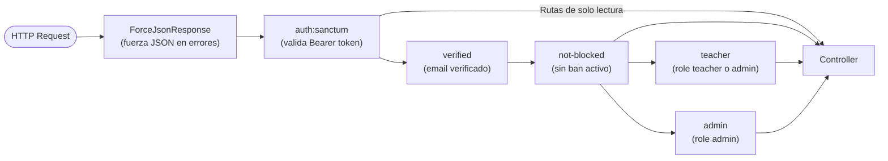
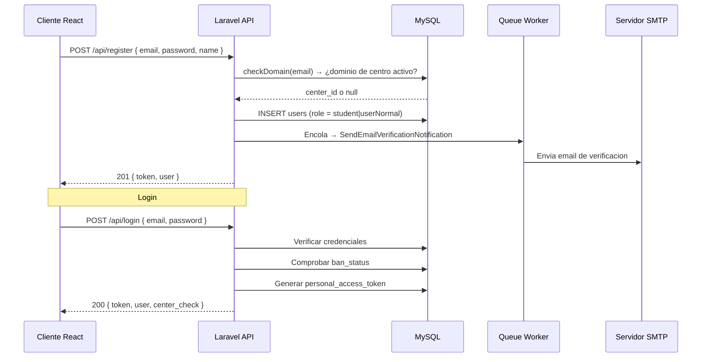
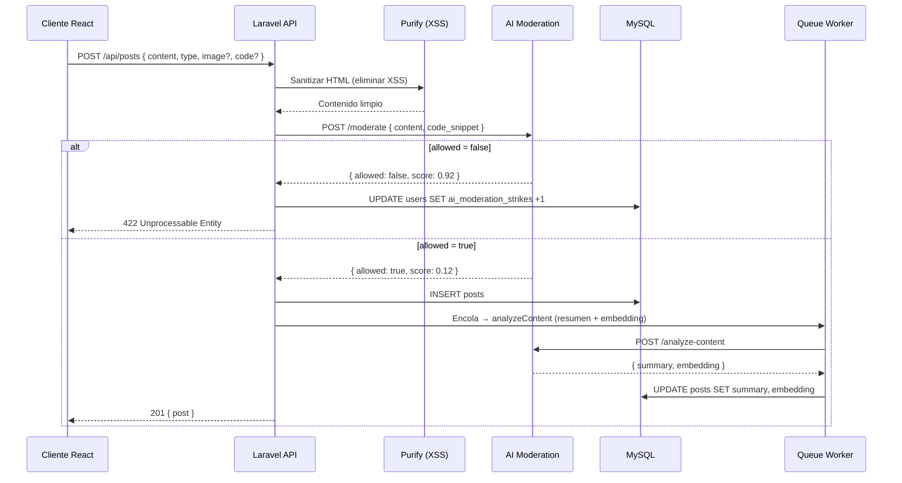
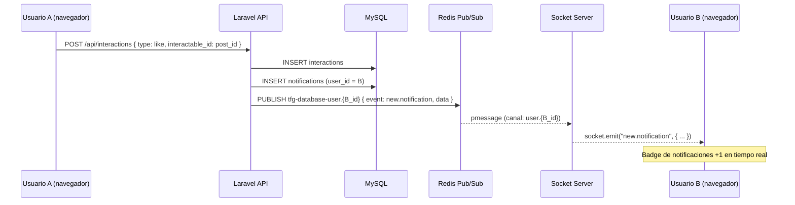
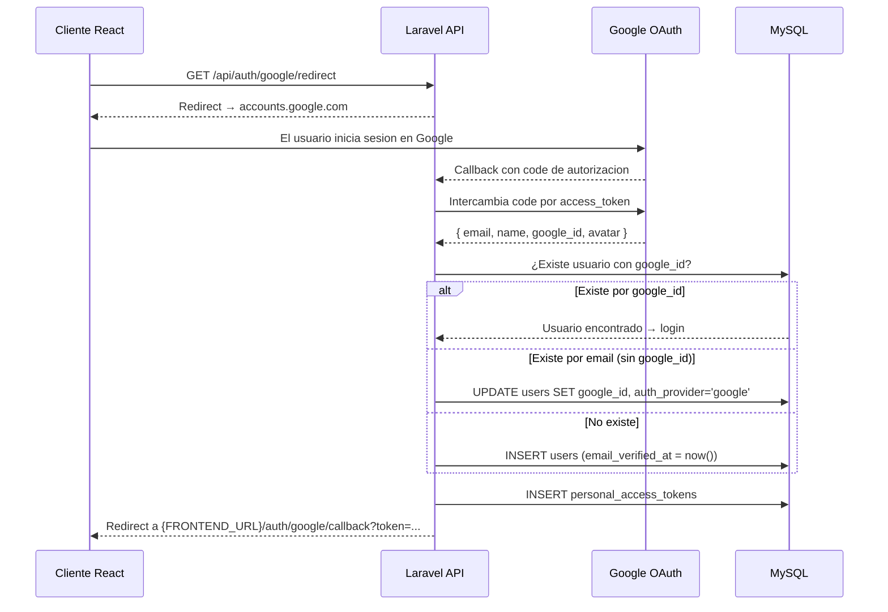
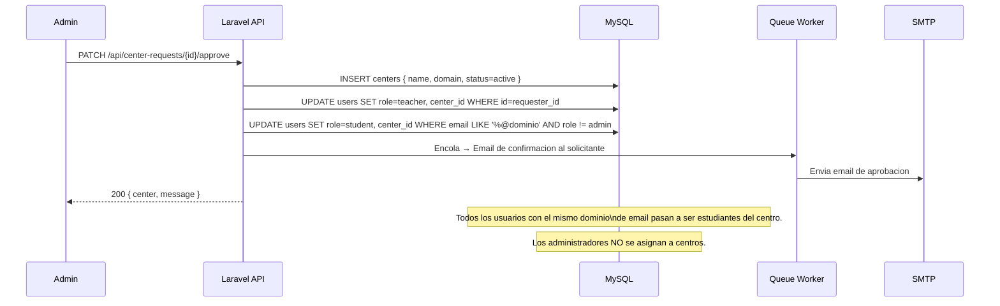

# Backend (API Laravel)

## Vision general

El backend es una API REST construida con Laravel 12 sobre PHP 8.3. Sigue el patron MVC de Laravel con una capa de Servicios para la logica de negocio compleja. Se comunica con MySQL como base de datos principal, Redis para cache y colas, y con varios servicios externos (Google OAuth, servidor SMTP, microservicio de IA).

---

## Diagrama de capas del sistema

---

## Librerias principales (composer.json)

### laravel/sanctum
Sistema de autenticacion por tokens para SPAs. Cuando un usuario hace login, Laravel genera un token de acceso personal que el cliente almacena en `localStorage` y envia en la cabecera `Authorization: Bearer {token}` en cada peticion autenticada.

A diferencia de JWT, los tokens de Sanctum se almacenan en la base de datos (tabla `personal_access_tokens`), lo que permite revocarlos en cualquier momento (logout). Cada token puede tener una fecha de expiracion (`expires_at`).

### laravel/socialite
Implementa el flujo OAuth2 con proveedores externos. En este proyecto se usa exclusivamente para Google OAuth. El flujo es:
1. El frontend redirige al usuario a `/api/auth/google/redirect`.
2. Google autentica al usuario y redirige a `/api/auth/google/callback`.
3. Socialite procesa el callback, obtiene los datos del usuario de Google y los usa para crear o actualizar la cuenta en la base de datos.
4. Se genera un token de Sanctum y se redirige al frontend con el token en la URL.

### resend/resend-laravel
Cliente para la API de Resend, un servicio de envio de emails transaccionales. Se usa como driver de correo de Laravel (alternativo a SMTP directo) cuando se configura `MAIL_MAILER=resend`.

### stevebauman/purify
Sanitizador HTML basado en HTMLPurifier. Se aplica al contenido de los posts y comentarios para eliminar etiquetas y atributos HTML peligrosos (XSS) antes de persistir el contenido en la base de datos.

---

## Middleware personalizado

### EnsureEmailIsVerified

Bloquea el acceso a rutas de escritura si el usuario no ha verificado su email. Devuelve 403 con `email_verified: false` si el usuario no esta verificado. Las rutas de solo lectura (notificaciones, sesion, perfil) no requieren verificacion para que el usuario pueda ver su estado de ban o cerrar sesion.

### EnsureNotBlocked

Bloquea el acceso a rutas de escritura si el usuario tiene `ban_status != "active"`. Un usuario baneado puede seguir leyendo notificaciones y cerrando sesion, pero no puede publicar, comentar ni enviar mensajes.

### EnsureIsAdmin

Solo permite el acceso si `$user->role === UserRole::Admin`. Usado en el grupo de rutas `/api/admin/*`.

### EnsureIsTeacher

Permite el acceso si el usuario es `teacher` o `admin`. Usado para las rutas de gestion del Hub del Centro.

### ForceJsonResponse

Fuerza el header `Accept: application/json` en todas las peticiones a la API para que los errores de Laravel se devuelvan como JSON en lugar de HTML.

---

## Flujos de datos principales

### Autenticacion y registro

### Creacion de post con moderacion de IA

### Flujo de notificaciones en tiempo real

### Conexion con Google OAuth

### Aprobacion de centros y asignacion automatica de usuarios

---

## Referencia completa de la API

### Autenticacion (publica)

| Metodo | Endpoint | Descripcion |
|---|---|---|
| POST | `/api/register` | Registro de usuario. Campos: `name`, `username`, `email`, `password`. |
| POST | `/api/login` | Login. Devuelve token y datos de usuario con `center_check`. |
| GET | `/api/auth/google/redirect` | Inicia el flujo OAuth con Google. |
| POST | `/api/auth/google/callback` | Callback de Google OAuth. |
| GET | `/api/email/verify/{id}/{hash}` | Verificacion de email con URL firmada. |
| POST | `/api/password/forgot` | Solicita email de reset de contrasena. Throttle: 5/min. |
| POST | `/api/password/reset` | Restablece la contrasena con el token del email. |

### Sesion (requiere auth:sanctum)

| Metodo | Endpoint | Descripcion |
|---|---|---|
| POST | `/api/logout` | Cierra la sesion, invalida el token actual. |
| GET | `/api/me` | Devuelve los datos completos del usuario autenticado. |
| POST | `/api/dismiss-center-prompt` | Marca el prompt de centro como descartado. |
| POST | `/api/email/resend` | Reenvia el email de verificacion. Throttle: 6/min. |
| GET | `/api/email/status` | Devuelve si el email esta verificado. |
| POST | `/api/password/set` | Establece contrasena inicial (usuarios de Google). |
| PUT | `/api/password/update` | Cambia la contrasena actual. |

### Posts y contenido (mixto)

| Metodo | Endpoint | Auth | Descripcion |
|---|---|---|---|
| GET | `/api/posts` | No | Listado de posts globales con filtros y paginacion. |
| GET | `/api/posts/{id}` | No | Detalle de un post. |
| GET | `/api/trending` | No | Posts trending calculados. |
| POST | `/api/posts` | Si + verified | Crea un post. Pasa por moderacion de IA. |
| PUT | `/api/posts/{id}` | Si + verified | Actualiza un post propio. |
| DELETE | `/api/posts/{id}` | Si + verified | Elimina un post (propio o como admin). |
| POST | `/api/posts/{id}/repost` | Si + verified | Reposta un post. |
| GET | `/api/feed/following` | Si + verified | Feed de usuarios que sigo. |
| GET | `/api/posts/{id}/comments` | No | Comentarios de un post. |
| POST | `/api/comments` | Si + verified | Crea un comentario. |
| PUT | `/api/comments/{id}` | Si + verified | Edita un comentario propio. |
| DELETE | `/api/comments/{id}` | Si + verified | Elimina un comentario propio. |
| PATCH | `/api/comments/{id}/solution` | Si + verified | Marca/desmarca comentario como solucion. |

### Interacciones (requiere auth + verified + not-blocked)

| Metodo | Endpoint | Descripcion |
|---|---|---|
| POST | `/api/interactions` | Toggle like/bookmark. Crea si no existe, elimina si ya existe. |
| GET | `/api/bookmarks` | Posts guardados por el usuario. |
| GET | `/api/liked` | Posts que le gustan al usuario. |

### Seguimiento de usuarios

| Metodo | Endpoint | Auth | Descripcion |
|---|---|---|---|
| GET | `/api/users/{id}/followers` | No | Lista de seguidores. |
| GET | `/api/users/{id}/following` | No | Lista de usuarios seguidos. |
| POST | `/api/users/{id}/follow` | Si | Toggle de seguimiento. Si el perfil es privado, crea solicitud pendiente. |
| GET | `/api/users/{id}/follow-status` | Si | Estado de seguimiento con ese usuario. |
| GET | `/api/follow-requests` | Si | Solicitudes de seguimiento pendientes. |
| POST | `/api/follow-requests/{id}/accept` | Si | Acepta una solicitud de seguimiento. |
| POST | `/api/follow-requests/{id}/reject` | Si | Rechaza una solicitud de seguimiento. |

### Perfil

| Metodo | Endpoint | Auth | Descripcion |
|---|---|---|---|
| GET | `/api/profile/{username}` | No | Datos del perfil publico. |
| GET | `/api/profile/{username}/posts` | No | Posts del perfil. |
| GET | `/api/profile/{username}/replies` | No | Comentarios del perfil. |
| PUT | `/api/profile` | Si | Actualiza el propio perfil. |
| GET | `/api/leaderboard` | No | Ranking de usuarios por reputacion. |

### Busqueda

| Metodo | Endpoint | Auth | Descripcion |
|---|---|---|---|
| GET | `/api/search?q=...` | No | Busqueda global de usuarios, posts y tags. |
| GET | `/api/center/search?q=...` | Si | Busqueda dentro del centro del usuario. |

### Etiquetas (Tags)

| Metodo | Endpoint | Auth | Descripcion |
|---|---|---|---|
| GET | `/api/tags` | No | Lista de todas las etiquetas. |
| GET | `/api/center/tags` | Si | Tags del centro del usuario. |
| GET | `/api/tags/followed` | Si | Tags que sigue el usuario. |
| POST | `/api/tags/{id}/follow` | Si | Toggle: seguir/dejar de seguir un tag. |
| PATCH | `/api/tags/{id}/notify` | Si | Toggle: activar/desactivar notificaciones de un tag. |

### Notificaciones (requiere auth)

| Metodo | Endpoint | Descripcion |
|---|---|---|
| GET | `/api/notifications` | Lista de notificaciones del usuario. |
| GET | `/api/notifications/count` | Numero de notificaciones no leidas. |
| PATCH | `/api/notifications/{id}/read` | Marca una notificacion como leida. |
| PATCH | `/api/notifications/read-all` | Marca todas como leidas. |
| DELETE | `/api/notifications/{id}` | Elimina una notificacion. |

### Chat P2P (requiere auth)

| Metodo | Endpoint | Descripcion |
|---|---|---|
| GET | `/api/chat/conversations` | Lista de conversaciones activas con ultimo mensaje. |
| GET | `/api/chat/conversations/{userId}` | Mensajes de una conversacion con un usuario. |
| POST | `/api/chat/messages` | Envia un mensaje. Valida que haya seguimiento mutuo. |
| POST | `/api/chat/conversations/{userId}/read` | Marca mensajes como leidos. |
| GET | `/api/chat/can-message/{userId}` | Verifica si puede enviar mensajes a ese usuario. |
| GET | `/api/chat/search-users` | Busca usuarios con seguimiento mutuo para el chat. |
| GET | `/api/chat/unread` | Numero total de mensajes no leidos. |

### Grupos de chat (requiere auth)

| Metodo | Endpoint | Descripcion |
|---|---|---|
| GET | `/api/groups` | Grupos en los que participa el usuario. |
| POST | `/api/groups` | Crea un grupo nuevo. |
| PUT | `/api/groups/{id}` | Actualiza nombre o imagen del grupo. |
| POST | `/api/groups/{id}/members` | Anade miembros al grupo. |
| DELETE | `/api/groups/{id}/members/{userId}` | Elimina un miembro del grupo. |
| POST | `/api/groups/{id}/members/{userId}/toggle-admin` | Cambia el rol de admin de un miembro. |
| POST | `/api/groups/{id}/leave` | El usuario abandona el grupo. |
| POST | `/api/groups/{id}/read` | Marca los mensajes del grupo como leidos. |
| POST | `/api/groups/{id}/image` | Sube una imagen de portada para el grupo. |

### Centros educativos

| Metodo | Endpoint | Auth | Descripcion |
|---|---|---|---|
| GET | `/api/centers` | Si | Lista de centros (activos para usuarios, todos para admin). |
| GET | `/api/centers/{id}` | No | Detalle de un centro. |
| GET | `/api/centers/{id}/members` | Si | Miembros del centro. |
| POST | `/api/centers` | Si | Solicita la creacion de un nuevo centro. |
| GET | `/api/center/posts` | Si | Posts del Hub privado del centro del usuario. |
| GET | `/api/center-requests/my` | Si | Mis solicitudes de centro pendientes. |

### Hub del Centro (requiere rol teacher o admin)

| Metodo | Endpoint | Descripcion |
|---|---|---|
| GET | `/api/center/members` | Lista de miembros del centro del teacher. |
| PATCH | `/api/center/members/{userId}/role` | Cambia el rol de un miembro. |
| PATCH | `/api/center/members/{userId}/block` | Bloquea a un miembro del centro. |
| PATCH | `/api/center/members/{userId}/unblock` | Desbloquea a un miembro. |
| DELETE | `/api/center/members/{userId}` | Expulsa a un miembro del centro. |
| PUT | `/api/centers/{id}` | Edita la informacion del centro. |

### Administracion (requiere rol admin)

| Metodo | Endpoint | Descripcion |
|---|---|---|
| GET | `/api/admin/stats` | Estadisticas: total usuarios, centros, solicitudes pendientes, posts. |
| GET | `/api/admin/users` | Lista de usuarios con filtros de busqueda y estado de ban. |
| GET | `/api/admin/users/{id}` | Detalle de un usuario. |
| GET | `/api/admin/users/{id}/posts` | Posts de un usuario especifico. |
| PUT | `/api/admin/users/{id}` | Edita datos de un usuario. |
| POST | `/api/admin/users/{id}/ban` | Banea a un usuario con razon y duracion opcional. |
| POST | `/api/admin/users/{id}/unban` | Desbanea a un usuario. |
| DELETE | `/api/admin/users/{id}` | Elimina permanentemente una cuenta de usuario. |
| GET | `/api/admin/posts` | Lista global de posts para moderacion. |
| GET | `/api/center-requests` | Todas las solicitudes de centros. |
| PATCH | `/api/center-requests/{id}/approve` | Aprueba una solicitud y crea el centro. |
| PATCH | `/api/center-requests/{id}/reject` | Rechaza una solicitud. |
| DELETE | `/api/centers/{id}` | Elimina un centro. |
| PATCH | `/api/centers/{id}/status` | Cambia el estado de un centro. |

---

## Esquema de base de datos

### Tabla `users`

Almacena todos los usuarios de la plataforma.

| Columna | Tipo | Descripcion |
|---|---|---|
| `id` | BIGINT | Clave primaria |
| `center_id` | BIGINT NULL | Centro al que pertenece (puede ser null) |
| `name` | VARCHAR(255) | Nombre completo |
| `username` | VARCHAR(255) UNIQUE | Nombre de usuario publico |
| `email` | VARCHAR(255) UNIQUE | Email (unico, se usa para login) |
| `email_verified_at` | TIMESTAMP NULL | NULL si no verificado |
| `password` | VARCHAR(255) | Hash bcrypt de la contrasena |
| `password_set_at` | TIMESTAMP NULL | NULL si usuario de Google sin contrasena propia |
| `google_id` | VARCHAR(255) UNIQUE NULL | ID de Google para OAuth |
| `auth_provider` | ENUM | `local` o `google` |
| `role` | ENUM | `admin`, `userNormal`, `student`, `teacher` |
| `avatar` | VARCHAR(255) NULL | Path o URL del avatar |
| `banner` | VARCHAR(255) NULL | Path o URL del banner de perfil |
| `bio` | TEXT NULL | Biografia del usuario |
| `is_private` | BOOLEAN | Perfil privado (requiere solicitud de seguimiento) |
| `is_blocked` | BOOLEAN | Bloqueado globalmente (no puede acceder) |
| `center_blocked` | BOOLEAN | Bloqueado del centro por un teacher |
| `ban_status` | VARCHAR | `active`, `temporary`, `permanent` |
| `ban_reason` | VARCHAR NULL | Razon del ban |
| `ban_expires_at` | TIMESTAMP NULL | Expiracion de ban temporal |
| `ai_moderation_strikes` | INT UNSIGNED | Numero de contenidos bloqueados por la IA |
| `linkedin_url`, `portfolio_url`, `external_url` | VARCHAR NULL | URLs profesionales del perfil |
| `center_prompt_dismissed` | BOOLEAN | El usuario ha cerrado el prompt de unirse a un centro |

### Tabla `posts`

| Columna | Tipo | Descripcion |
|---|---|---|
| `id` | BIGINT | Clave primaria |
| `user_id` | BIGINT | Autor del post (FK users) |
| `center_id` | BIGINT NULL | Si tiene valor, es un post del Hub del Centro (privado) |
| `original_post_id` | BIGINT NULL | Si tiene valor, es un repost de ese post |
| `type` | ENUM | `news` (publicacion) o `question` (pregunta tecnica) |
| `is_solved` | BOOLEAN | Solo para questions: si tiene solucion verificada |
| `content` | TEXT NULL | Contenido HTML sanitizado |
| `image_url` | VARCHAR NULL | Path de imagen adjunta |
| `code_snippet` | LONGTEXT NULL | Codigo de programacion adjunto |
| `code_language` | VARCHAR NULL | Lenguaje del snippet para syntax highlighting |
| `summary` | TEXT NULL | Resumen generado por IA |
| `embedding` | JSON NULL | Vector de embeddings para trending |
| `deleted_at` | TIMESTAMP NULL | Soft delete: el post existe en BD pero no es visible |

Los indices compuestos en `(center_id, created_at)` y `(user_id, center_id)` optimizan las consultas del feed del centro.

### Tabla `comments`

Soporta jerarquia de comentarios con `parent_id`. Un comentario con `is_solution=true` es la respuesta marcada como solucion para una question.

### Tabla `follows`

Tabla pivot con `follower_id` y `followed_id`. El campo `status` puede ser `pending` (para perfiles privados) o `accepted`.

### Tabla `interactions`

Tabla polimorfica para likes y bookmarks. `interactable_type` indica la clase del modelo (Post o Comment) y `interactable_id` el ID.

### Tabla `tags` + `post_tag` + `tag_user`

Las etiquetas tienen nombre, slug y color. Se relacionan con posts via `post_tag` y con usuarios via `tag_user` (con campo `notify` para notificaciones).

### Tabla `centers` + `center_requests`

Los centros tienen un `domain` unico que se usa para la asignacion automatica de usuarios. Las solicitudes de creacion de centros pasan por un proceso de revision admin (estado: `pending`, `approved`, `rejected`).

### Tablas de chat

`chat_messages` soporta mensajes P2P (`sender_id`, `receiver_id`) y mensajes de grupo (`group_id`). Los grupos se gestionan con `groups` y `group_members`, donde `last_read_message_id` permite calcular mensajes no leidos por miembro.

### Tabla `notifications`

Polimorfica: `notifiable_type` y `notifiable_id` indican a que objeto hace referencia la notificacion. `read_at` es NULL para notificaciones no leidas.

### Tabla `trending_posts`

Calcula el trending por ventanas de tiempo (`window_start`, `window_end`) con un `score` y `rank`. Se recalcula periodicamente via un comando programado de Laravel.

---

## Tests

Los tests se ejecutan con PHPUnit contra una base de datos SQLite en memoria (`RefreshDatabase`).

### AuthCenterFlowTest

Es el test mas completo. Cubre cuatro flujos criticos:

1. **Admin sin prompt de centro**: Verifica que los administradores nunca ven el prompt para unirse a un centro, ya que son globales.

2. **Login normal con prompt**: Verifica que un usuario con email educativo, sin centro y sin haber descartado el prompt, recibe `needs_center_prompt: true`.

3. **Bloqueo por email no verificado**: Verifica que usuarios sin verificar no pueden crear posts, comentarios ni mensajes, pero si pueden leer notificaciones y acceder a `/api/me`.

4. **Asignacion automatica al aprobar centro**: Verifica que al aprobar una solicitud de centro, todos los usuarios con el mismo dominio de email se asignan automaticamente como estudiantes, excepto los administradores.

### PostUpdateTest

Cubre la creacion de posts con imagen (verificando que el archivo se sube correctamente al storage) y el toggle de likes (verificando que se crea la interaccion en la BD y se genera una notificacion).

### RouteHealthTest

Itera sobre todas las rutas GET de la API sin parametros y verifica que ninguna devuelve un error 500 (error interno). Los 401 y 403 son aceptables (rutas protegidas sin token).

### SocketEventTest

Cubre que los eventos de broadcasting se disparan correctamente al hacer like en un post (verifica que el evento `NotificationSent` se emite con el canal correcto).

---

## Referencia de archivos

- Rutas: [api/routes/api.php](file:///home/chuclao/Escritorio/projecte-final-2025-26-daw-codex_trfinal_grup4/api/routes/api.php)
- Controladores: [api/app/Http/Controllers/](file:///home/chuclao/Escritorio/projecte-final-2025-26-daw-codex_trfinal_grup4/api/app/Http/Controllers)
- Middleware: [api/app/Http/Middleware/](file:///home/chuclao/Escritorio/projecte-final-2025-26-daw-codex_trfinal_grup4/api/app/Http/Middleware)
- Modelos: [api/app/Models/](file:///home/chuclao/Escritorio/projecte-final-2025-26-daw-codex_trfinal_grup4/api/app/Models)
- Servicios: [api/app/Services/](file:///home/chuclao/Escritorio/projecte-final-2025-26-daw-codex_trfinal_grup4/api/app/Services)
- Tests: [api/tests/Feature/](file:///home/chuclao/Escritorio/projecte-final-2025-26-daw-codex_trfinal_grup4/api/tests/Feature)
- Esquema BD: [doc/context/schema.sql](file:///home/chuclao/Escritorio/projecte-final-2025-26-daw-codex_trfinal_grup4/doc/context/schema.sql)
