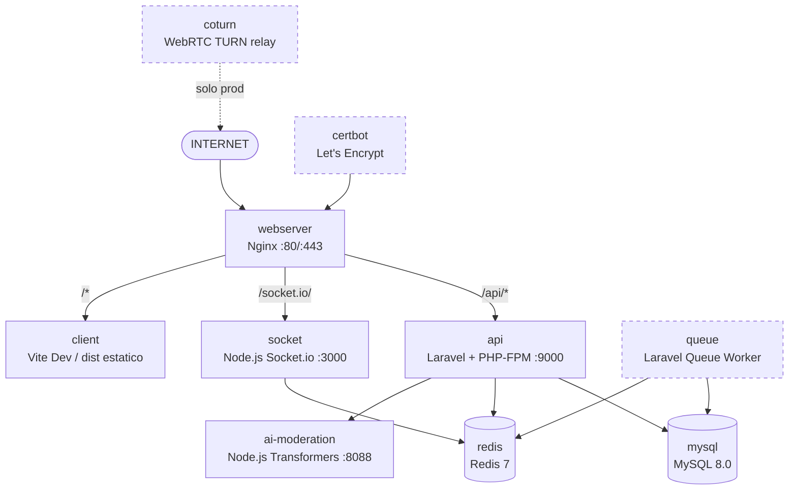

# Docker y Despliegue

## Arquitectura de contenedores

El proyecto usa Docker Compose para orquestar todos los servicios. Existen dos configuraciones: desarrollo local y produccion. Ambas comparten la red interna `tfg_network`.



---

## Contenedores en detalle

### webserver (Nginx)

Punto de entrada unico. Enruta segun el path:

- `/api/*` : FastCGI a PHP-FPM en `api:9000`
- `/socket.io/` : Proxy HTTP + WebSocket upgrade a `socket:3000`
- `/storage/` : Archivos subidos por usuarios (volumen compartido con api)
- `/*` : Archivos estaticos de React, con fallback a `index.html` para el SPA

### api (Laravel + PHP-FPM)

Laravel en modo FastCGI. Usa MySQL, Redis y llama al microservicio `ai-moderation`. El Dockerfile tiene dos targets: `development` (con Xdebug y codigo montado como volumen) y `production` (autoloader optimizado, sin debug).

### queue (Laravel Queue Worker)

Solo existe en produccion. Misma imagen que `api`, arranca con `php artisan queue:work --tries=3 --timeout=90`. Procesa emails, logs de moderacion y otras tareas asincronas.

### ai-moderation

Servidor HTTP en `ai-moderation:8088`, solo accesible internamente. Ver [AI_MODERATION.md](./AI_MODERATION.md).

### client (React + Vite)

En **desarrollo**: servidor Vite con HMR, Nginx hace proxy.\
En **produccion**: contenedor efimero que compila con `vite build`, copia los archivos al volumen `client_build` y sale. Las variables `VITE_*` se inyectan en el momento del build y no pueden cambiarse sin recompilar.

### mysql (MySQL 8.0)

Base de datos principal. Datos en volumen `mysql_data`. Con healthcheck para que los dependientes esperen hasta que este listo.

### redis (Redis 7)

Usado para cache, colas de Laravel y Pub/Sub de broadcasting (la comunicacion entre Laravel y el servidor de sockets).

---

## Diferencias desarrollo vs. produccion

| Aspecto | Desarrollo | Produccion |
|---|---|---|
| Protocolo | HTTP puerto 8080 | HTTPS puerto 443 + SSL |
| SSL | No | Let's Encrypt (Certbot) |
| Frontend | Vite Dev Server con HMR | Archivos estaticos compilados |
| PHP Debug | `APP_DEBUG=true` | `APP_DEBUG=false` |
| Redis auth | Sin contrasena | Con contrasena obligatoria |
| MySQL | Puerto 3306 expuesto al host | Solo accesible internamente |
| Adminer | Puerto 8081 | No incluido |
| Mailpit | Puertos 1025 y 8025 | No incluido (usa SMTP real) |
| Queue worker | No incluido | Contenedor `queue` dedicado |
| TURN server | No incluido | Coturn para WebRTC relay |
| Restart policy | `unless-stopped` | `always` |

---

## Nginx en produccion

```mermaid
flowchart TD
    R(["Request HTTP/HTTPS"])
    P80{"Puerto 80?"}
    ACME{"Path\n/.well-known/\nacme-challenge?"}
    REDIR["301 Redirect\na HTTPS"]
    ACMEF["Sirve fichero\nACME challenge"]
    P443["Servidor HTTPS\n(TLS 1.2 + 1.3)"]
    API{"Path /api/*?"}
    SOCK{"Path /socket.io/?"]
    STOR{"Path /storage/?"}
    STAT{"Asset estatico?\n(.js, .css, .png...)"}
    PHPFPM["FastCGI PHP-FPM\napi:9000"]
    SOCKP["Proxy WebSocket\nsocket:3000"]
    STORF["Volumen api_storage"]
    STATF["Cache 1 ano\nheader immutable"]
    SPA["try_files\n/index.html (SPA fallback)"]

    R --> P80
    P80 -- Si --> ACME
    ACME -- Si --> ACMEF
    ACME -- No --> REDIR
    P80 -- No --> P443
    P443 --> API
    API -- Si --> PHPFPM
    API -- No --> SOCK
    SOCK -- Si --> SOCKP
    SOCK -- No --> STOR
    STOR -- Si --> STORF
    STOR -- No --> STAT
    STAT -- Si --> STATF
    STAT -- No --> SPA
```

- TLS 1.2 y 1.3, ciphers modernos, HSTS 6 meses, OCSP Stapling.
- Compresion Gzip para JS, CSS, JSON, SVG y fuentes.
- Cache de 1 ano para assets estaticos con header `immutable`.
- Cabeceras de seguridad: `X-Frame-Options`, `X-Content-Type-Options`, `X-XSS-Protection`, `Referrer-Policy`, `Permissions-Policy`.

---

## Variables de entorno (.env) explicadas

### Aplicacion Laravel

| Variable | Descripcion |
|---|---|
| `APP_NAME` | Nombre de la app. Se usa como prefijo en canales Redis (`tfg-database-`). |
| `APP_ENV` | `local` en dev, `production` en prod. |
| `APP_DEBUG` | `false` siempre en produccion. |
| `APP_URL` | URL publica del backend. Para links de correo y URLs de storage. |
| `APP_KEY` | Clave de cifrado. Generada con `php artisan key:generate`. |
| `FRONTEND_URL` | URL del frontend. Para CORS y links en correos. |
| `CORS_ALLOWED_ORIGINS` | Origenes permitidos para peticiones CORS separados por coma. |

### Base de datos

| Variable | Descripcion |
|---|---|
| `DB_ROOT_PASSWORD` | Contrasena root de MySQL. |
| `DB_DATABASE` | Nombre de la base de datos. |
| `DB_USERNAME` | Usuario de la aplicacion. |
| `DB_PASSWORD` | Contrasena del usuario de la aplicacion. |
| `DB_HOST` | Host de MySQL (nombre del servicio: `mysql`). |
| `DB_PORT` | Puerto (3306). |

### Redis

| Variable | Descripcion |
|---|---|
| `REDIS_HOST` | Host de Redis (nombre del servicio: `redis`). |
| `REDIS_PORT` | Puerto (6379). |
| `REDIS_PASSWORD` | Contrasena de Redis. Vacio en dev, obligatorio en prod. |
| `REDIS_CLIENT` | Driver PHP: `phpredis` (extension nativa, mas rapida que predis). |

### Correo electronico

| Variable | Descripcion |
|---|---|
| `MAIL_MAILER` | Driver: `smtp` o `resend`. |
| `MAIL_HOST` | Servidor SMTP. En dev: `mail` (mailpit). En prod: servidor real. |
| `MAIL_PORT` | Puerto SMTP: 587 (STARTTLS), 465 (SSL). |
| `MAIL_USERNAME` | Usuario SMTP. |
| `MAIL_PASSWORD` | Contrasena SMTP. |
| `MAIL_ENCRYPTION` | `tls`, `ssl` o `null`. |
| `MAIL_FROM_ADDRESS` | Direccion de remitente. |
| `MAIL_FROM_NAME` | Nombre del remitente. |

### Google OAuth

| Variable | Descripcion |
|---|---|
| `GOOGLE_CLIENT_ID` | ID de cliente de Google Cloud Console. |
| `GOOGLE_CLIENT_SECRET` | Secreto de cliente de Google. |
| `GOOGLE_REDIRECT_URI` | URL de callback OAuth. |

### Frontend (Vite)

Se inyectan en el build. No pueden cambiarse sin recompilar.

| Variable | Descripcion |
|---|---|
| `VITE_API_URL` | URL completa de la API incluyendo `/api`. |
| `VITE_SOCKET_URL` | URL del servidor de sockets. |
| `VITE_GOOGLE_CLIENT_ID` | ID de cliente de Google para el boton de login. |
| `VITE_TURN_SERVER` | URL del servidor TURN para WebRTC. |
| `VITE_TURN_USERNAME` | Usuario del servidor TURN. |
| `VITE_TURN_CREDENTIAL` | Credencial del servidor TURN. |

### AI Moderation

| Variable | Descripcion |
|---|---|
| `AI_MODERATION_ENABLED` | Activa o desactiva la llamada al servicio de IA desde Laravel. |
| `AI_MODERATION_URL` | URL interna (`http://ai-moderation:8088`). |
| `AI_MODERATION_API_KEY` | Clave de autenticacion entre Laravel y el servicio. |
| `AI_MODERATION_TIMEOUT_SECONDS` | Timeout en segundos para la llamada al servicio. |
| `AI_BLOCK_THRESHOLD` | Umbral de bloqueo de toxic-bert (0.85). |
| `AI_ZERO_SHOT_BLOCK_THRESHOLD` | Umbral de bloqueo zero-shot (0.75). |
| `AI_LLM_ENABLED` | Activa el LLM externo. |
| `AI_LLM_API_KEY` | Clave API del LLM. |

### Dominio

| Variable | Descripcion |
|---|---|
| `DOMAIN` | Dominio de produccion. Se usa en Nginx para los certificados SSL. |
| `SOCKET_PORT` | Puerto del servidor de sockets (3000, solo interno). |

---

## Volumenes

| Volumen | Descripcion |
|---|---|
| `mysql_data` | Datos de MySQL. Persiste entre reinicios. |
| `redis_data` | Datos de Redis (appendonly). |
| `api_storage` | Archivos subidos por usuarios. Compartido entre `api` y `webserver`. |
| `client_build` | Archivos compilados de React. Compartido entre `client` y `webserver`. |
| `certbot_www` | Archivos del desafio ACME. Compartido entre `certbot` y `webserver`. |

---

## Comandos frecuentes

```bash
# Levantar en desarrollo
docker compose -f docker-compose.dev.yml up --build

# Levantar en produccion
docker compose -f docker-compose.prod.yml up --build -d

# Ver logs de un servicio
docker compose -f docker-compose.prod.yml logs -f api

# Ejecutar migraciones en produccion
docker compose -f docker-compose.prod.yml exec api php artisan migrate

# Consola interactiva de Laravel
docker compose -f docker-compose.prod.yml exec api php artisan tinker

# Recompilar el frontend en produccion
docker compose -f docker-compose.prod.yml up --build client
docker compose -f docker-compose.prod.yml restart webserver
```

---

## Referencia de archivos

- [docker-compose.dev.yml](file:///home/chuclao/Escritorio/projecte-final-2025-26-daw-codex_trfinal_grup4/docker-compose.dev.yml)
- [docker-compose.prod.yml](file:///home/chuclao/Escritorio/projecte-final-2025-26-daw-codex_trfinal_grup4/docker-compose.prod.yml)
- [docker/nginx/default.dev.conf](file:///home/chuclao/Escritorio/projecte-final-2025-26-daw-codex_trfinal_grup4/docker/nginx/default.dev.conf)
- [docker/nginx/default.prod.conf](file:///home/chuclao/Escritorio/projecte-final-2025-26-daw-codex_trfinal_grup4/docker/nginx/default.prod.conf)
- [init-dev.sh](file:///home/chuclao/Escritorio/projecte-final-2025-26-daw-codex_trfinal_grup4/init-dev.sh)
- [init-ssl.sh](file:///home/chuclao/Escritorio/projecte-final-2025-26-daw-codex_trfinal_grup4/init-ssl.sh)
