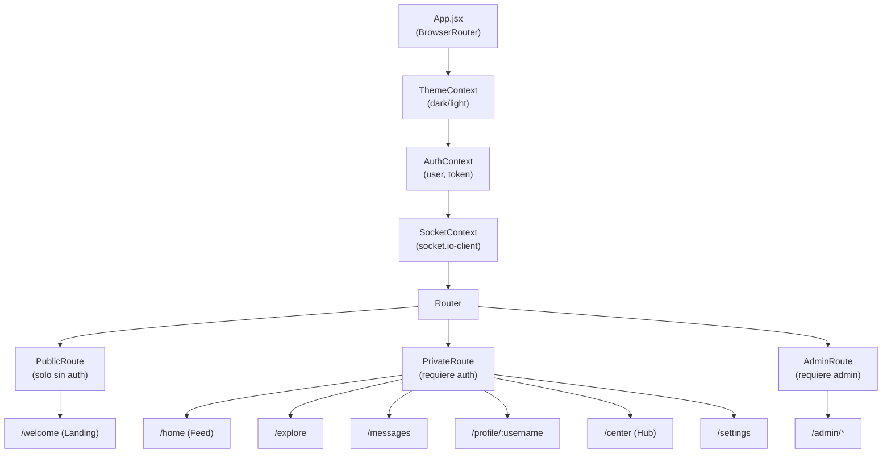
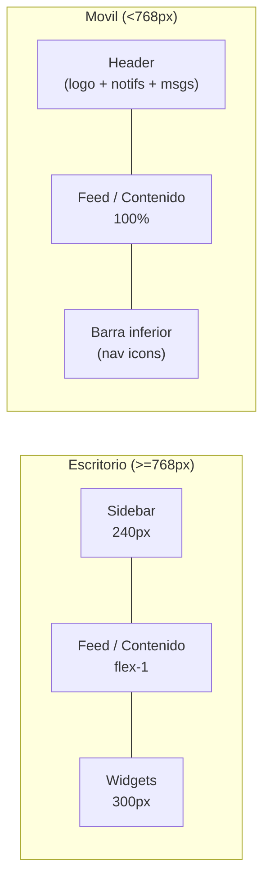

# Frontend (React + Vite)

## Vision general

El cliente es una Single Page Application (SPA) construida con React 18 y Vite. Una SPA carga el HTML una sola vez y desde ese punto gestiona toda la navegacion en el cliente, sin recargas de pagina. Esto permite transiciones instantaneas entre vistas y una experiencia de usuario fluida similar a una aplicacion nativa.

La aplicacion tiene soporte completo para tres idiomas (castellano, catalan e ingles), modo oscuro por defecto con toggle a modo claro, y un diseno responsive que adapta la estructura de tres columnas en escritorio a un layout movil con navegacion inferior.



---

## Sistema de diseno

### Paleta de colores

El tema base es "Academic Dark Mode", inspirado en editores de codigo y entornos de desarrollo. Los colores se definen como variables CSS en `src/styles/variables.css`:

| Token | Valor | Uso |
|---|---|---|
| `--codex-deep-slate` | `#0f1419` | Fondo base principal |
| `--codex-teal` | `#14b8a6` | Acento primario (botones, links activos, badges) |
| `--codex-violet` | `#8b5cf6` | Acento secundario (DAM, etiquetas especiales) |
| `--codex-amber` | `#f59e0b` | Alertas, avisos del Hub del Centro |
| `--codex-emerald` | `#10b981` | Estados de exito, puntos de reputacion |

La escala de superficies (`--depth-0` a `--depth-5`) crea jerarquia visual mediante diferentes niveles de luminosidad del fondo. Las tarjetas de posts usan `--depth-1`, los modales `--depth-3`, etc.

### Tipografia

- **Interfaz de usuario:** Plus Jakarta Sans (Google Fonts, sans-serif)
- **Codigo:** JetBrains Mono (Google Fonts, monospace)

### Responsive: escritorio vs. movil



En movil (< 768px):
- La columna derecha de widgets desaparece.
- El sidebar izquierdo se oculta y se muestra en su lugar una barra de navegacion fija en la parte inferior de la pantalla con los links principales.
- El header muestra el logo de Codex y accesos rapidos a notificaciones y mensajes.

---

## Librerias

### react-router-dom (v7)

Gestiona la navegacion del SPA. Define las rutas en `src/router/index.jsx`. Usa `BrowserRouter`, `Routes` y `Route` para mapear URLs a componentes de pagina. Incluye proteccion de rutas mediante componentes wrapper:

- `PrivateRoute`: requiere que el usuario este autenticado. Si no, redirige a `/welcome`.
- `AdminRoute`: requiere que el usuario sea administrador. Si no, redirige al inicio.
- `PublicRoute`: solo accesible sin autenticacion (login, register). Si ya esta logueado, redirige al feed.

### i18next + react-i18next + i18next-browser-languagedetector

Sistema de internacionalizacion. Los textos de la interfaz se definen en archivos JSON por idioma en `src/locales/` (`es.json`, `ca.json`, `en.json`). El hook `useTranslation()` se usa en los componentes para obtener los textos traducidos. El detector de idioma del navegador selecciona automaticamente el idioma inicial basandose en las preferencias del sistema.

### socket.io-client

Cliente WebSocket que conecta con el servidor de Socket.io. La conexion y los listeners se gestionan centralizadamente en `src/context/SocketContext.jsx`. Los componentes que necesitan tiempo real se suscriben a eventos a traves de este contexto.

### highlight.js

Libreria de syntax highlighting para bloques de codigo. Se usa en las tarjetas de posts (`PostCard.jsx`) y en el detalle de post (`PostDetail.jsx`) para colorear el codigo segun el lenguaje detectado o especificado por el usuario.

### lucide-react

Iconos SVG como componentes React. Proporciona un conjunto consistente de iconos de interfaz (Trash2, Eye, Search, Filter, etc.) sin dependencias externas de fuentes de iconos.

### react-helmet-async

Gestiona las etiquetas `<head>` del documento (title, meta description, og:image) de forma dinamica desde los componentes. Se usa en las paginas publicas para SEO: el perfil de usuario muestra el nombre del usuario en el title, el detalle de post muestra el contenido truncado, etc.

### recharts

Libreria de graficos basada en SVG para React. Se usa en el panel de administracion para mostrar graficos de estadisticas (usuarios registrados, posts por semana, etc.).

---

## Contextos globales (Context API)

### AuthContext (`src/context/AuthContext.jsx`)

Es el contexto mas importante de la aplicacion. Gestiona el estado de autenticacion y lo expone a toda la aplicacion. Almacena:

- `user`: objeto con todos los datos del usuario autenticado (o null si no esta logueado).
- `token`: el token de Sanctum almacenado en `localStorage`.
- `login(data)`: guarda el token y los datos del usuario, actualiza el estado.
- `logout()`: llama a `/api/logout`, elimina el token del `localStorage` y limpia el estado.
- `updateUser(data)`: actualiza parcialmente los datos del usuario (se usa al editar el perfil).
- `isAdmin()`, `isTeacher()`: helpers para verificar el rol.

Al inicializar la aplicacion, el contexto llama a `/api/me` con el token almacenado para restaurar la sesion si el token sigue siendo valido.

### SocketContext (`src/context/SocketContext.jsx`)

Gestiona la conexion con el servidor de Socket.io. Cuando el usuario esta autenticado, crea la conexion y emite el evento `join` con el userId para unirse a la sala personal. Expone:

- `socket`: la instancia de socket.io-client.
- Listeners pre-configurados para eventos globales como `new.notification`.

### ThemeContext (`src/context/ThemeContext.jsx`)

Gestiona el tema visual (oscuro/claro). Persiste la preferencia en `localStorage`. Aplica la clase `dark` o `light` al elemento `<html>` para activar las variables CSS correspondientes.

---

## Paginas

### Landing (`/welcome`)

Pagina publica de bienvenida. Muestra la descripcion de la plataforma, funcionalidades y los formularios de login y registro en un modal. En movil los formularios se muestran en pantalla completa. Incluye el boton de Google OAuth.

### Home (`/`)

Punto de entrada del feed global. Carga el componente `Feed.jsx` con las distintas pestanas: "Para ti" (todos los posts globales), "Siguiendo" (solo de usuarios que sigo) y "Preguntas" (solo posts de tipo question).

### Explore (`/explore`)

Busqueda global. Permite buscar usuarios, posts y etiquetas. Muestra resultados en tiempo real al escribir (con debounce de 300ms). En escritorio muestra un panel lateral con tendencias y etiquetas populares.

### CenterHub (`/center`)

Hub privado del centro educativo. Solo accesible para usuarios con `center_id`. Muestra el feed exclusivo del centro, la lista de miembros, y para los teachers un panel de gestion de miembros (bloquear, cambiar rol, expulsar). Las publicaciones del Hub estan marcadas con `center_id` y son invisibles en el feed global.

### Messages (`/messages`)

Pagina de mensajes directos. En escritorio muestra la lista de conversaciones a la izquierda y el chat activo a la derecha. En movil muestra primero la lista y al seleccionar una conversacion ocupa toda la pantalla con un boton de "volver". Soporta chat P2P y grupos. Incluye indicador de escritura y marcado de mensajes como leidos. Los mensajes fluyen en tiempo real via Socket.io.

### Notifications (`/notifications`)

Lista de notificaciones: likes, comentarios, nuevos seguidores, mensajes, etc. Con badge de conteo en el sidebar que se actualiza en tiempo real. Permite marcar todas como leidas.

### PostDetail (`/post/:id`)

Vista detallada de un post. Muestra el contenido completo con syntax highlighting si tiene codigo. Lista los comentarios anidados. Si el usuario esta logueado, puede comentar y marcar comentarios como solucion (en posts de tipo question).

### ProfilePage (`/profile/:username`)

Perfil publico del usuario. Muestra estadisticas (posts, seguidores, seguidos, puntos de reputacion), bio, links profesionales y el listado de posts y respuestas. Si el perfil es privado, muestra los datos basicos pero oculta el contenido hasta que haya seguimiento.

### Settings (`/settings`)

Configuracion de la cuenta: editar nombre, username, bio, avatar, banner, links profesionales, preferencias de privacidad y cambio de contrasena.

### Panel de administracion (`/admin/*`)

Protegido por `AdminRoute`. Estructura de subrutas:
- `/admin` → `AdminOverview`: estadisticas globales con graficos.
- `/admin/users` → `AdminUsers`: gestion de usuarios, busqueda, ban/unban, cambio de rol.
- `/admin/posts` → `AdminPosts`: listado global de publicaciones con filtro y eliminacion.
- `/admin/moderation` → `AdminModeration`: wrapper para moderacion de usuarios del centro.
- `/admin/centers` → `AdminCenters`: gestion de centros educativos.
- `/admin/requests` → `AdminRequests`: solicitudes de centros pendientes.

### Paginas de autenticacion secundarias

- `/forgot-password`: formulario para solicitar email de reset de contrasena.
- `/reset-password`: formulario con el token del email para establecer la nueva contrasena.
- `/verify-email`: pantalla de espera de verificacion de email con boton para reenviar.
- `/auth/google/callback`: pagina invisible que extrae el token de la URL y completa el login con Google.
- `/blocked`: pantalla de usuario bloqueado con informacion del ban.
- `/legal`: pagina de terminos y politica de privacidad.

---

## Estructura de componentes

### Layout

- `MainLayout.jsx`: shell de tres columnas que envuelve todas las rutas autenticadas. Renderiza el Sidebar izquierdo, el area de contenido principal y la columna derecha de widgets.
- `Sidebar.jsx`: navegacion principal con los links a las secciones. En movil se transforma en barra de navegacion inferior. Incluye los links del panel de admin visibles solo para administradores.
- `RightSection.jsx`: columna derecha con el buscador, tendencias y sugerencias de usuarios.

### Feed

- `Feed.jsx`: lista de posts con scroll infinito y pestanas.
- `PostCard.jsx`: tarjeta de post con preview de contenido, syntax highlighting, botones de interaccion (like, bookmark, repost, comentar) y opciones de eliminar/editar.
- `PostInput.jsx`: editor de publicaciones. Permite texto, imagen, codigo con selector de lenguaje, y hashtags con autocompletado.

### Chat

- `Messages.jsx`: la pagina de mensajes en si. Gestiona la lista de conversaciones, el chat activo, la emision y recepcion de mensajes a traves del socket.

---

## Flujo de autenticacion en el frontend

```mermaid
flowchart TD
    Entry([\"Usuario entra a la app\"])
    TokenCheck{\"Token en\\nlocalStorage?\"}
    FetchMe[\"GET /api/me\"]
    Me200{\"Respuesta 200?\"}
    LoadUser[\"Cargar sesion\\n(user, token)\"]
    ClearToken[\"Limpiar localStorage\\n(token expirado)\"]
    NotAuth[\"Estado: no autenticado\"]
    RouteCheck[\"Router evalua la ruta\"]
    IsPrivate{\"PrivateRoute?\"}
    IsPublic{\"PublicRoute?\"}
    IsAdmin{\"AdminRoute?\"}
    RedirLogin[\"/welcome\"]
    RedirHome[\"/\"]
    RedirHomeBis[\"/\"]
    RenderPage[\"Renderiza la pagina\"]

    Entry --> TokenCheck
    TokenCheck -- Si --> FetchMe
    TokenCheck -- No --> NotAuth
    FetchMe --> Me200
    Me200 -- Si --> LoadUser --> RouteCheck
    Me200 -- No --> ClearToken --> NotAuth --> RouteCheck
    RouteCheck --> IsPrivate
    IsPrivate -- Si, no auth --> RedirLogin
    IsPrivate -- Si, auth --> RenderPage
    RouteCheck --> IsPublic
    IsPublic -- Si, auth --> RedirHome
    IsPublic -- Si, no auth --> RenderPage
    RouteCheck --> IsAdmin
    IsAdmin -- Si, no admin --> RedirHomeBis
    IsAdmin -- Si, admin --> RenderPage
```

---

## Referencia de archivos

- Router: [client/src/router/index.jsx](file:///home/chuclao/Escritorio/projecte-final-2025-26-daw-codex_trfinal_grup4/client/src/router/index.jsx)
- AuthContext: [client/src/context/AuthContext.jsx](file:///home/chuclao/Escritorio/projecte-final-2025-26-daw-codex_trfinal_grup4/client/src/context/AuthContext.jsx)
- SocketContext: [client/src/context/SocketContext.jsx](file:///home/chuclao/Escritorio/projecte-final-2025-26-daw-codex_trfinal_grup4/client/src/context/SocketContext.jsx)
- Variables CSS: [client/src/styles/variables.css](file:///home/chuclao/Escritorio/projecte-final-2025-26-daw-codex_trfinal_grup4/client/src/styles/variables.css)
- Traducciones ES: [client/src/locales/es.json](file:///home/chuclao/Escritorio/projecte-final-2025-26-daw-codex_trfinal_grup4/client/src/locales/es.json)
- Paginas: [client/src/pages/](file:///home/chuclao/Escritorio/projecte-final-2025-26-daw-codex_trfinal_grup4/client/src/pages)
- Componentes: [client/src/components/](file:///home/chuclao/Escritorio/projecte-final-2025-26-daw-codex_trfinal_grup4/client/src/components)
- package.json: [client/package.json](file:///home/chuclao/Escritorio/projecte-final-2025-26-daw-codex_trfinal_grup4/client/package.json)
