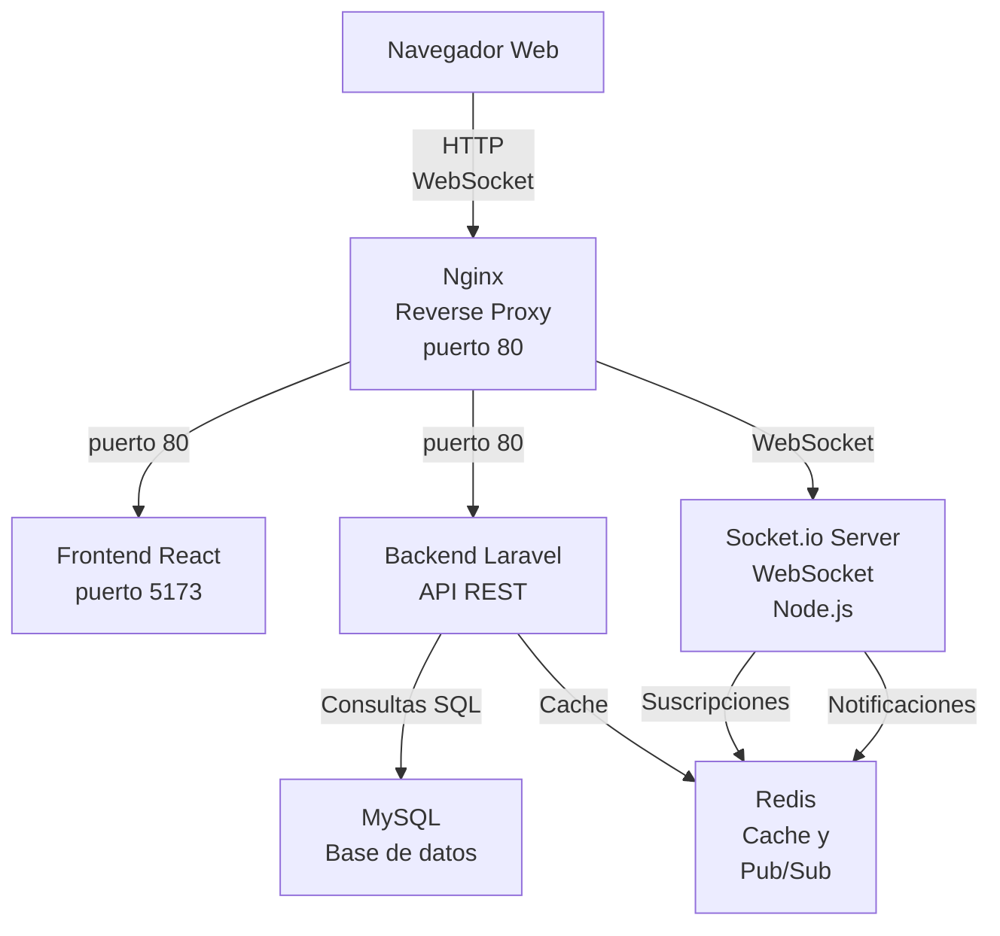
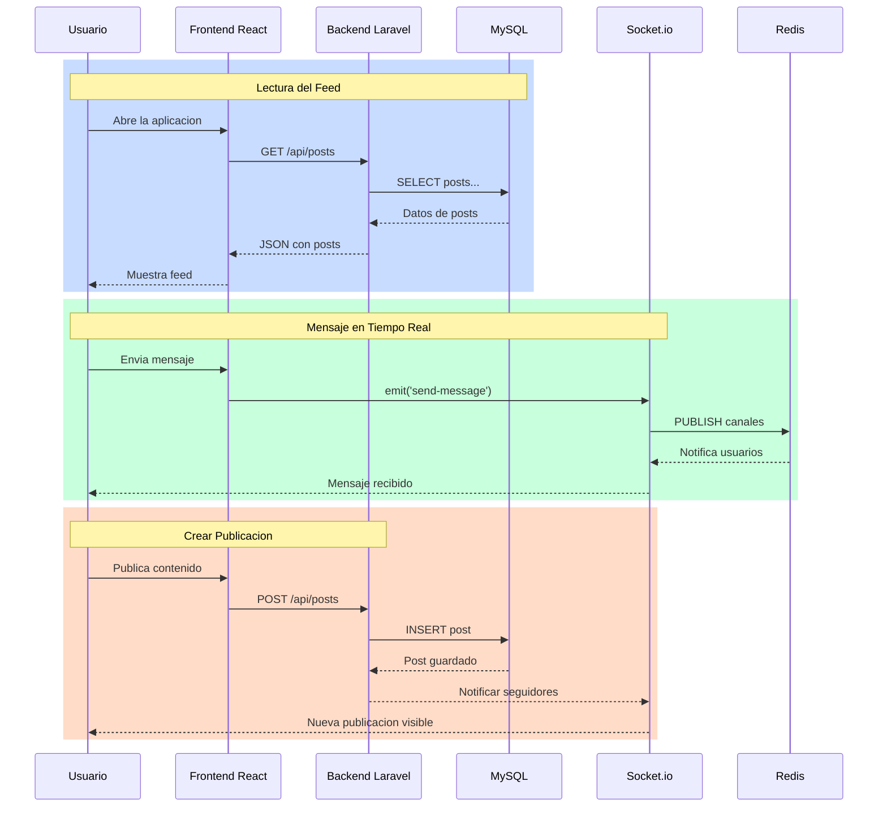
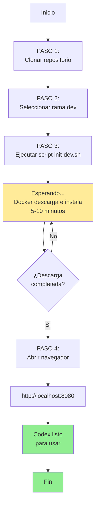
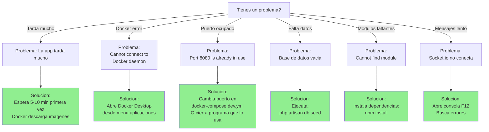
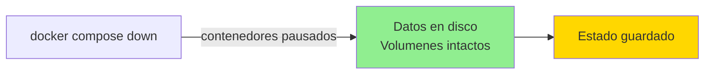
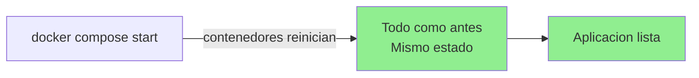
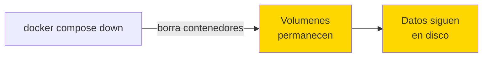
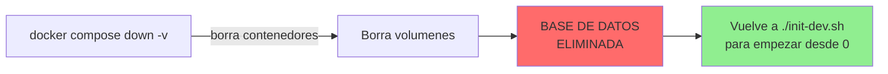

# Manual de Instalacion - Codex TRFinal

## Indice

1. [Descripcion General del Proyecto](#descripcion-general-del-proyecto)
2. [Como Funciona el Proyecto](#como-funciona-el-proyecto)
3. [Requisitos de Sistema](#requisitos-de-sistema)
4. [Instalacion Paso a Paso](#instalacion-paso-a-paso)
5. [Verificar que Todo Funciona](#verificar-que-todo-funciona)
6. [Solucionar Problemas Comunes](#solucionar-problemas-comunes)
7. [Trabajar en el Proyecto](#trabajar-en-el-proyecto)
8. [Parar los Servicios](#parar-los-servicios)

---

## Descripcion General del Proyecto

Codex es una plataforma social para estudiantes de centros educativos. Permite crear publicaciones, seguir a otros usuarios, enviar mensajes en tiempo real, hacer videollamadas y colaborar dentro de grupos.

### Caracteristicas Principales

- Autenticacion de usuarios (registro e inicio de sesion)
- Feed social con publicaciones
- Sistema de mensajeria en tiempo real con WebSockets
- Videollamadas entre usuarios (WebRTC)
- Hubs por centro educativo
- Sistema de grupos colaborativos
- Soporte para tres idiomas (castellano, catalan, ingles)
- Modo oscuro por defecto
- Interfaz adaptable (escritorio y movil)

---

## Como Funciona el Proyecto

### Arquitectura General

Codex utiliza una arquitectura de **microservicios** basada en contenedores Docker. Esto significa que cada componente principal corre en su propio contenedor independiente:



### Los Cuatro Componentes Principales

1. **Frontend (React + Vite)**
   - Aplicacion web que ves en el navegador
   - Corre en tu navegador web
   - Se conecta al servidor mediante HTTP y WebSockets

2. **Backend (Laravel)**
   - API REST que gestiona usuarios, publicaciones, grupos, etc.
   - Corre en un contenedor con PHP 8.3
   - Almacena datos en la base de datos MySQL

3. **Socket.io (Node.js)**
   - Servidor de tiempo real para mensajes, notificaciones y videollamadas
   - Mantiene conexiones WebSocket abiertas
   - Se comunica con Redis para distribuir mensajes

4. **Base de Datos (MySQL) y Cache (Redis)**
   - MySQL almacena toda la informacion del proyecto
   - Redis guarda datos temporales y cache

### Flujo de Informacion

Cuando un usuario realiza diferentes acciones en la aplicacion:



---

## Requisitos de Sistema

### Checklist de Requisitos

```
ANTES DE INSTALAR, TIENES QUE TENER:

[ ] Git
    - Necesario para clonar el proyecto
    - Descargar desde: https://git-scm.com/
    
[ ] Docker Desktop
    - Version 24.0 o superior
    - Descargar desde: https://www.docker.com/products/docker-desktop/
    - Incluye Docker Engine + Docker Compose
    
[ ] Editor de codigo (opcional pero recomendado)
    - Visual Studio Code: https://code.visualstudio.com/
    - O cualquier otro que prefieras
    
[ ] Espacio en disco
    - Minimo 5 GB libres para los contenedores
    
[ ] RAM disponible
    - Minimo 4 GB (recomendado 8 GB o mas)
```

### Verificar Instalacion

### Verificar Instalacion

Abre una terminal y ejecuta estos comandos uno por uno:

```bash
# Comando 1
git --version
# Esperado: git version X.X.X (o similar)

# Comando 2
docker --version
# Esperado: Docker version XX.X.X (o similar)

# Comando 3
docker compose version
# Esperado: Docker Compose version X.X.X (o similar)
```

Si todos los comandos muestran versiones sin errores, estas listo para instalar Codex.

Si alguno falla:
- Reinstala el software correspondiente desde los enlaces anteriores
- Reinicia tu ordenador si acabas de instalar Docker
- En Mac/Linux, puede que necesites abrir una terminal nueva

---

## Instalacion Paso a Paso

Este es el flujo completo desde cero. Sigue cada paso en orden:



### Paso 1: Clonar el Repositorio

Abre una terminal en la carpeta donde quieras el proyecto:

```bash
git clone https://github.com/inspedralbes/projecte-final-2025-26-daw-codex_trfinal_grup4.git
cd projecte-final-2025-26-daw-codex_trfinal_grup4
```

### Paso 2: Seleccionar la Rama Correcta

El proyecto tiene dos ramas principales:
- `main`: Rama estable y lista para produccion
- `dev`: Rama de desarrollo con las ultimas features

Para desarrollo, usa `dev`:

```bash
git checkout dev
```

### Paso 3: Ejecutar el Script de Inicializacion

El proyecto incluye un script que automatiza toda la configuracion:

```bash
chmod +x init-dev.sh
./init-dev.sh
```

Este script:
- Copia la configuracion del proyecto
- Descarga todas las dependencias
- Crea la base de datos
- Inicia los contenedores Docker

**En Windows con PowerShell:**
```powershell
.\init-dev.sh
```

**Si Windows no reconoce el script:**
1. Abre Docker Desktop si aun no lo has hecho
2. Abre PowerShell como administrador
3. Ejecuta: `Set-ExecutionPolicy -ExecutionPolicy RemoteSigned -Scope CurrentUser`
4. Vuelve a intentar el comando anterior

### Paso 4: Esperar a que Todo Este Listo

El script tardara algunos minutos la primera vez (descargando imagenes, compilando). Espera a que termine sin interrumpir.

Una vez terminado, veras mensajes indicando que los servicios estan listos.

---

## Verificar que Todo Funciona

### Acceso a la Aplicacion

Una vez que todo esta listo, abre tu navegador web en estas direcciones:

| Servicio | URL | Descripcion |
|----------|-----|-------------|
| Aplicacion Principal | http://localhost:8080 | La app Codex (normalmente aqui) |
| Servidor de Desarrollo | http://localhost:5173 | Alternativa con actualizacion en vivo |
| Adminer (Base de datos) | http://localhost:8081 | Gestor web de MySQL |
| Mailpit (Correos) | http://localhost:8025 | Visor de correos de prueba |

### Verificar que Funciona

1. Abre http://localhost:8080 en tu navegador
2. Deberias ver la pantalla de bienvenida de Codex
3. Intenta registrarte con:
   - Email: test@example.com
   - Contraseña: password123

Si logras acceder, todo esta funcionando correctamente.

### Ver los Logs de los Contenedores

Para verificar que no hay errores internos:

```bash
docker compose -f docker-compose.dev.yml logs -f
```

Esto mostrara los logs de todos los contenedores. Presiona Ctrl+C para salir.

---

## Solucionar Problemas Comunes



## Trabajar en el Proyecto

### Estructura de Carpetas

```
projecte-final-2025-26-daw-codex_trfinal_grup4/
│
├── api/                      ← BACKEND (Laravel)
│   ├── app/
│   │   ├── Http/Controllers/ ← Logica de publicaciones, usuarios, etc.
│   │   ├── Models/           ← Definiciones de datos (User, Post, etc.)
│   │   └── Services/         ← Logica compartida
│   │
│   ├── routes/
│   │   └── api.php           ← Todas las rutas de la API
│   │
│   ├── database/
│   │   ├── migrations/       ← Cambios en la estructura de BD
│   │   └── seeders/          ← Datos de prueba iniciales
│   │
│   └── tests/                ← Tests automaticos
│
├── client/                   ← FRONTEND (React)
│   ├── src/
│   │   ├── components/       ← Partes reutilizables de UI
│   │   │   ├── chat/
│   │   │   ├── post/
│   │   │   └── ...
│   │   │
│   │   ├── pages/            ← Paginas completas
│   │   │   ├── Home.jsx
│   │   │   ├── Messages.jsx
│   │   │   ├── Profile.jsx
│   │   │   └── ...
│   │   │
│   │   ├── services/         ← Llamadas a API
│   │   │   ├── api.js
│   │   │   ├── socketService.js
│   │   │   └── ...
│   │   │
│   │   ├── context/          ← Estado global (Auth, Socket, Theme)
│   │   ├── hooks/            ← Funciones reutilizables
│   │   ├── styles/           ← CSS
│   │   └── App.jsx           ← Componente raiz
│   │
│   └── package.json          ← Dependencias de frontend
│
├── socket/                   ← SERVIDOR DE TIEMPO REAL (Node.js)
│   ├── index.js              ← Archivo principal
│   ├── config/               ← Configuraciones
│   └── package.json          ← Dependencias de Node.js
│
├── docker/                   ← CONFIGURACIONES DOCKER
│   ├── nginx/
│   │   ├── default.dev.conf  ← Configuracion Nginx para desarrollo
│   │   └── default.prod.conf ← Configuracion Nginx para produccion
│   │
│   ├── php/
│   │   └── php.dev.ini       ← Configuracion PHP
│   │
│   └── mysql/
│       ├── init.sql          ← Script para inicializar BD
│       └── my.cnf            ← Configuracion MySQL
│
├── doc/                      ← DOCUMENTACION
│   ├── BACKEND.md
│   ├── FRONTEND.md
│   ├── SOCKET.md
│   └── ...
│
├── docker-compose.dev.yml    ← Orquestacion desarrollo
├── docker-compose.prod.yml   ← Orquestacion produccion
├── init-dev.sh               ← Script de instalacion
└── .env                      ← Variables de entorno
```

### Hacer Cambios en el Codigo

El desarrollo ya esta configurado para que los cambios se reflejen automaticamente:

1. **Backend (Laravel):**
   - Edita archivos en `api/`
   - Los cambios se aplican automaticamente

2. **Frontend (React):**
   - Edita archivos en `client/src/`
   - Las paginas se actualizan automaticamente en http://localhost:5173

3. **Socket.io:**
   - Edita `socket/index.js`
   - Necesitas reiniciar: `docker compose -f docker-compose.dev.yml restart socket`

### Acceder a la Terminal de un Contenedor

Si necesitas ejecutar comandos dentro de un contenedor:

```bash
# Terminal del Backend (Laravel)
docker compose -f docker-compose.dev.yml exec api bash

# Terminal del Frontend (Node.js)
docker compose -f docker-compose.dev.yml exec client bash

# Terminal del Socket.io
docker compose -f docker-compose.dev.yml exec socket bash

# Consola MySQL
docker compose -f docker-compose.dev.yml exec mysql mysql -uroot -p
# Contraseña: root
```

### Ejecutar Comandos de Laravel

Dentro del contenedor de API o desde fuera:

```bash
# Ver migraciones pendientes
docker compose -f docker-compose.dev.yml exec api php artisan migrate:status

# Ejecutar migraciones
docker compose -f docker-compose.dev.yml exec api php artisan migrate

# Limpiar cache
docker compose -f docker-compose.dev.yml exec api php artisan cache:clear

# Crear un usuario de prueba
docker compose -f docker-compose.dev.yml exec api php artisan tinker
# Dentro de tinker:
# App\Models\User::create(['name' => 'Test', 'email' => 'test@codex.local', 'password' => bcrypt('password')])
```

### Inspeccionar la Base de Datos

Opcion 1 - Interfaz grafica (Adminer):
- Ve a http://localhost:8081
- Sistema: MySQL
- Usuario: root
- Contraseña: root
- Base de datos: codex

Opcion 2 - Linea de comandos:
```bash
docker compose -f docker-compose.dev.yml exec mysql mysql -uroot -proot codex
```

### Revisar Correos Enviados

Ve a http://localhost:8025 para ver todos los correos que la aplicacion envia durante las pruebas.

---

## Parar los Servicios

### Parar sin Eliminar Datos



### Iniciar de Nuevo



### Parar y Eliminar Todo



### Eliminar Volumenes Limpiar Base de Datos



---

## Configuracion Avanzada

### Cambiar el Puerto de la Aplicacion

Edita `docker-compose.dev.yml`:

```yaml
services:
  nginx:
    ports:
      - "8000:80"  # Cambiar 8080 a 8000 aqui
```

Reinicia:
```bash
docker compose -f docker-compose.dev.yml restart
```

La app estara en http://localhost:8000

### Cambiar la Contraseña de MySQL

Edita `.env`:

```
DB_PASSWORD=tu_nueva_contraseña
```

Luego borra y reinicia:
```bash
docker compose -f docker-compose.dev.yml down -v
docker compose -f docker-compose.dev.yml up -d
```

### Ver Logs Detallados

```bash
# Logs de un servicio especifico
docker compose -f docker-compose.dev.yml logs api

# Logs en tiempo real
docker compose -f docker-compose.dev.yml logs -f api

# Ultimas 100 lineas
docker compose -f docker-compose.dev.yml logs --tail=100 api
```

---

## Proximos Pasos Despues de la Instalacion

1. **Lee la documentacion tecnica** en `doc/README.md` si quieres entender como funciona cada parte
2. **Explora el codigo frontend** en `client/src/` para ver como esta estructurada la interfaz
3. **Revisa las rutas de la API** en `doc/BACKEND.md` para entender que puedes hacer
4. **Crea una publicacion de prueba** en la app para familiarizarte con las funcionalidades

---

## Contacto y Ayuda

Si tienes problemas que no puedes resolver:

1. Consulta `docker-compose.dev.yml` para ver la configuracion de los servicios
2. Revisa los logs: `docker compose -f docker-compose.dev.yml logs`
3. Verifica que Docker Desktop este corriendo
4. Intenta reiniciar todo: `docker compose -f docker-compose.dev.yml down` y luego `./init-dev.sh`

---

## Resumen Rapido

```bash
# Clonar proyecto
git clone https://github.com/inspedralbes/projecte-final-2025-26-daw-codex_trfinal_grup4.git
cd projecte-final-2025-26-daw-codex_trfinal_grup4

# Seleccionar rama de desarrollo
git checkout dev

# Inicializar todo
chmod +x init-dev.sh && ./init-dev.sh

# Abrir en navegador
# http://localhost:8080

# Parar servicios
docker compose -f docker-compose.dev.yml down

# Reiniciar
docker compose -f docker-compose.dev.yml up -d
```
