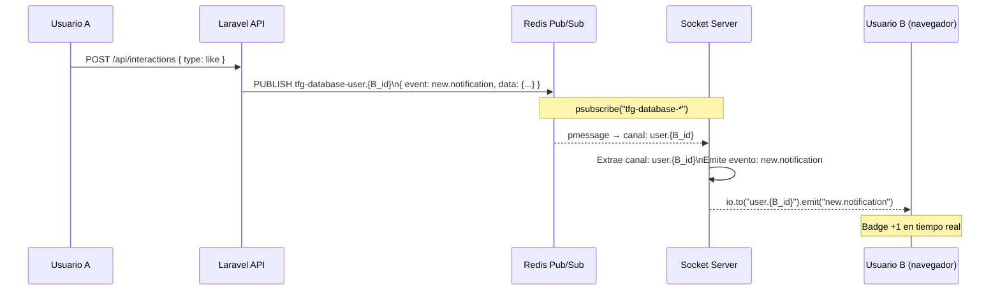
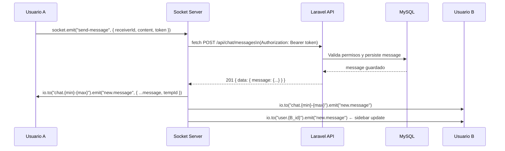
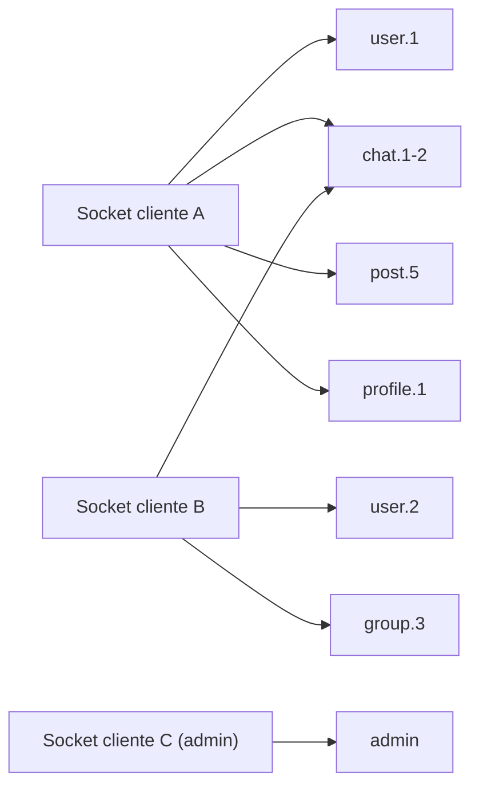
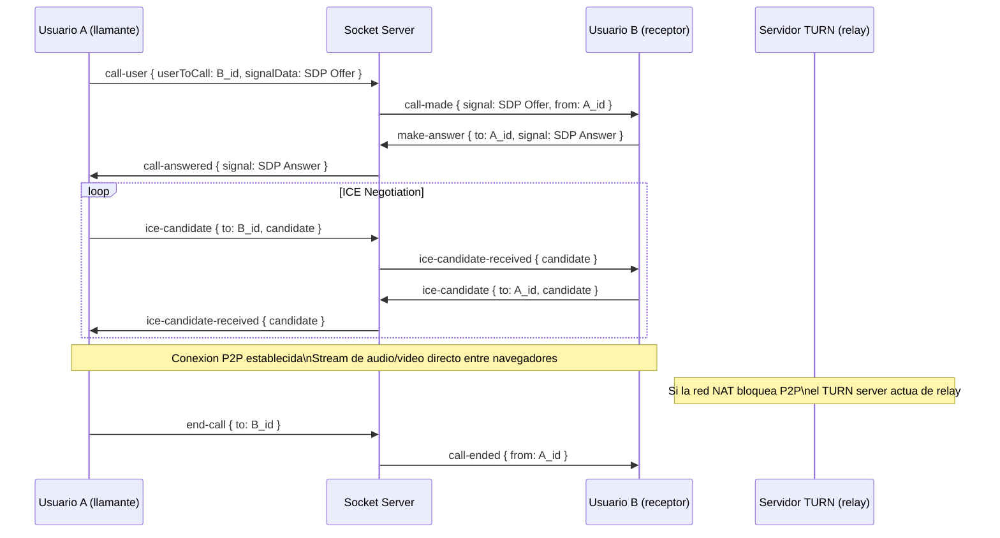

# Socket Server (Tiempo Real)

## Que es y para que sirve

El servidor de Socket.io es un proceso independiente en Node.js que gestiona toda la comunicacion bidireccional en tiempo real entre los clientes y el sistema. Actua como un puente entre dos mundos: recibe eventos de Laravel publicados a traves de Redis, y los reenvía a los clientes conectados a traves de WebSockets.

Tambien actua como intermediario directo para los mensajes de chat, validando los permisos a traves de la API de Laravel antes de hacer el broadcast.

---

## Libreria principal: Socket.io

Socket.io es una libreria que abstrae la comunicacion en tiempo real sobre WebSockets, con soporte de fallback a polling HTTP cuando los WebSockets no estan disponibles. Usa un modelo de salas (rooms) para agrupar conexiones y enviar eventos de forma selectiva.

La version usada es `socket.io` v4 en el servidor y `socket.io-client` v4.8 en el cliente React.

---

## Flujo general de comunicacion

Existen dos patrones de flujo en el sistema:

### Patron 1: Redis Pub/Sub (eventos de Laravel hacia el cliente)

Este patron se usa para notificaciones, actualizaciones de perfil, likes y cualquier evento que Laravel genera internamente.

El prefijo del canal de Redis es configurable via `REDIS_PREFIX` (por defecto `tfg-database-`). El socket server suscribe con wildcard `tfg-database-*` para capturar todos los canales de Laravel con un solo `psubscribe`.

### Patron 2: Socket directo (mensajes de chat)

Los mensajes de chat se envian directamente a traves del socket, sin pasar por HTTP desde el cliente. El socket valida y persiste llamando a la API de Laravel internamente.

---

## Sistema de salas (Rooms)

Cada cliente al conectarse se une a las salas relevantes para su sesion. Las salas son simplemente identificadores de string que agrupan sockets.

Cada cliente al conectarse se une a las salas relevantes para su sesion. Las salas son simplemente identificadores de string que agrupan sockets.

| Sala | Formato | Uso |
|---|---|---|
| Room personal | `user.{userId}` | Notificaciones, mensajes nuevos (sidebar) |
| Room de chat P2P | `chat.{minId}-{maxId}` | Mensajes en tiempo real entre dos usuarios |
| Room de grupo | `group.{groupId}` | Mensajes de grupos de chat |
| Room de post | `post.{postId}` | Comentarios en tiempo real al ver un post |
| Room de perfil | `profile.{userId}` | Actualizaciones de seguidores en el perfil |
| Room de admin | `admin` | Notificaciones globales del panel de administracion |

El identificador del chat P2P siempre usa los IDs ordenados de menor a mayor para garantizar que la sala sea la misma independientemente de quien inicie la conversacion. Por ejemplo, los usuarios 3 y 7 siempre compartiran la sala `chat.3-7`.

---

## Eventos que escucha el servidor (cliente → servidor)

| Evento | Payload | Descripcion |
|---|---|---|
| `join` | `{ userId }` | Une el socket a la sala personal del usuario |
| `join-admin` | (ninguno) | Une el socket a la sala de administracion |
| `join-post` | `{ postId }` | Une el socket a la sala de un post |
| `leave-post` | `{ postId }` | Abandona la sala de un post |
| `join-profile` | `{ userId }` | Une el socket a la sala de un perfil |
| `leave-profile` | `{ userId }` | Abandona la sala de un perfil |
| `join-chat` | `{ userId, partnerId }` | Une el socket a la sala de chat P2P |
| `leave-chat` | `{ userId, partnerId }` | Abandona la sala de chat P2P |
| `join-group` | `{ groupId }` | Une el socket a un grupo de chat |
| `leave-group` | `{ groupId }` | Abandona un grupo de chat |
| `typing` | `{ userId, partnerId, isTyping }` | Emite indicador de escritura al interlocutor |
| `send-message` | `{ receiverId, groupId, content, tempId, token }` | Envia un mensaje de chat (P2P o grupo) |
| `mark-read` | `{ partnerId, userId, token }` | Marca mensajes como leidos |
| `call-user` | `{ userToCall, signalData, from, callerInfo, isVideo }` | Inicia una llamada WebRTC |
| `make-answer` | `{ to, signal, from }` | Responde a una llamada WebRTC |
| `ice-candidate` | `{ to, candidate, from }` | Intercambia candidatos ICE para WebRTC |
| `end-call` | `{ to, from }` | Finaliza una llamada |
| `reject-call` | `{ to, from }` | Rechaza una llamada entrante |
| `video-toggle` | `{ to, isVideoOff, from }` | Notifica cambio de estado de video |
| `audio-toggle` | `{ to, isMuted, from }` | Notifica cambio de estado de audio |

---

## Eventos que emite el servidor (servidor → cliente)

Estos eventos son recibidos por el cliente React a traves del `SocketContext.jsx`.

| Evento | Destinatario | Descripcion |
|---|---|---|
| `new.notification` | `user.{userId}` | Nueva notificacion (like, comentario, follow, etc.) |
| `new.message` | `chat.{ids}` / `user.{userId}` / `group.{id}` | Nuevo mensaje de chat |
| `messages.read` | `chat.{ids}` | Confirmacion de lectura de mensajes |
| `user.typing` | `chat.{ids}` / `group.{id}` | Indicador de escritura |
| `call-made` | `user.{userId}` | Llamada entrante (WebRTC offer) |
| `call-answered` | `user.{userId}` | Llamada aceptada (WebRTC answer) |
| `ice-candidate-received` | `user.{userId}` | Candidato ICE WebRTC |
| `call-ended` | `user.{userId}` | Llamada finalizada |
| `call-rejected` | `user.{userId}` | Llamada rechazada |
| `peer-video-toggle` | `user.{userId}` | Estado de video del interlocutor cambiado |
| `peer-audio-toggle` | `user.{userId}` | Estado de audio del interlocutor cambiado |

---

## Eventos publicados por Laravel en Redis

Laravel usa el sistema de Broadcasting integrado para publicar eventos. Cada evento tiene un canal y un nombre de evento asociados.

| Evento Laravel | Canal Redis | Evento Socket |
|---|---|---|
| `NotificationSent` | `tfg-database-user.{userId}` | `new.notification` |
| `NewMessage` | (gestionado directamente por socket) | `new.message` |
| `FollowStatusUpdated` | `tfg-database-profile.{userId}` | `follow.updated` |

---

## WebRTC y llamadas de voz/video

El servidor de Socket.io actua como servidor de senalizacion (signaling server) para WebRTC. WebRTC es un protocolo P2P que permite comunicacion de audio y video directamente entre navegadores, pero necesita un intermediario para intercambiar la informacion de conexion inicial (offer, answer, ICE candidates).

Para los casos donde la conexion P2P directa no es posible (redes NAT estrictas), el sistema dispone de un servidor TURN (Coturn) configurado en produccion que actua de relay.

---

## Seguridad del socket

Los mensajes de chat se validan en Laravel antes de persistirse. El cliente envia su token Bearer de Sanctum junto con cada mensaje de chat a traves del socket, y el servidor de socket lo usa para llamar a la API de Laravel (`POST /api/chat/messages`). Si el token es invalido o el usuario no tiene permiso para enviar mensajes, la API rechaza la solicitud y el socket devuelve un error al callback del cliente.

La autenticacion de la conexion WebSocket en si misma no usa tokens; la autorizacion granular se delega a la API en operaciones criticas.

---

## Libreria Redis: ioredis

La conexion a Redis se gestiona con la libreria `ioredis`, configurada en `socket/config/redis.js`. El servidor de socket crea un cliente Redis dedicado solo para suscripcion (un cliente Redis en modo suscripcion no puede ejecutar otros comandos). La suscripcion usa `psubscribe` con el patron wildcard `tfg-database-*`.

---

## Variables de entorno del socket

| Variable | Descripcion |
|---|---|
| `PORT` | Puerto HTTP del servidor (por defecto 3000) |
| `REDIS_HOST` | Host del servidor Redis |
| `REDIS_PORT` | Puerto Redis (por defecto 6379) |
| `REDIS_PASSWORD` | Contrasena de Redis |
| `REDIS_PREFIX` | Prefijo de los canales de Laravel (por defecto `tfg-database-`) |
| `CORS_ORIGIN` | Origen permitido para conexiones WebSocket |
| `API_URL` | URL base de la API de Laravel (para llamadas internas) |
| `VITE_API_URL` | URL completa de la API incluyendo `/api` |
| `NODE_ENV` | Entorno (`development` o `production`) |

---

## Referencia de archivos

- Servidor principal: [socket/index.js](file:///home/chuclao/Escritorio/projecte-final-2025-26-daw-codex_trfinal_grup4/socket/index.js)
- Configuracion Redis: [socket/config/redis.js](file:///home/chuclao/Escritorio/projecte-final-2025-26-daw-codex_trfinal_grup4/socket/config/redis.js)
- Contexto socket en React: [client/src/context/SocketContext.jsx](file:///home/chuclao/Escritorio/projecte-final-2025-26-daw-codex_trfinal_grup4/client/src/context/SocketContext.jsx)
- Test de eventos: [api/tests/Feature/SocketEventTest.php](file:///home/chuclao/Escritorio/projecte-final-2025-26-daw-codex_trfinal_grup4/api/tests/Feature/SocketEventTest.php)
